# NanoClaw v2 完整技術教學

> 個人 Claude 助理 — 輕量、安全、在容器中隔離執行的 Telegram Bot 智慧助手

---

## 目錄

1. [專案概覽](#1-專案概覽)
2. [設計哲學](#2-設計哲學)
3. [整體架構](#3-整體架構)
4. [目錄結構](#4-目錄結構)
5. [核心元件詳解](#5-核心元件詳解)
   - [5.1 主程式 index.ts](#51-主程式-indexts)
   - [5.2 Telegram 頻道 telegram.ts](#52-telegram-頻道-telegramts)
   - [5.3 設定檔 config.ts](#53-設定檔-configts)
   - [5.4 型別定義 types.ts](#54-型別定義-typests)
   - [5.5 資料庫層 db.ts](#55-資料庫層-dbts)
   - [5.6 訊息路由 router.ts](#56-訊息路由-routerts)
   - [5.7 容器執行器 container-runner.ts](#57-容器執行器-container-runnerts)
   - [5.8 IPC 監視器 ipc.ts](#58-ipc-監視器-ipcts)
   - [5.9 任務排程器 task-scheduler.ts](#59-任務排程器-task-schedulerts)
   - [5.10 群組佇列 group-queue.ts](#510-群組佇列-group-queuets)
   - [5.11 掛載安全模組 mount-security.ts](#511-掛載安全模組-mount-securityts)
   - [5.12 日誌模組 logger.ts](#512-日誌模組-loggerts)
6. [Container 機制](#6-container-機制)
   - [6.1 Dockerfile](#61-dockerfile)
   - [6.2 Agent Runner](#62-agent-runner)
   - [6.3 IPC MCP Server](#63-ipc-mcp-server)
   - [6.4 Container 建構流程](#64-container-建構流程)
7. [訊息流程](#7-訊息流程)
8. [多輪容器與串流輸出](#8-多輪容器與串流輸出)
9. [IPC 通訊機制](#9-ipc-通訊機制)
10. [AgentBrain 記憶體系統](#10-agentbrain-記憶體系統)
11. [排程任務系統](#11-排程任務系統)
12. [安全模型](#12-安全模型)
13. [部署與服務管理](#13-部署與服務管理)
14. [Skills 系統](#14-skills-系統)
15. [技術棧總覽](#15-技術棧總覽)

---

## 1. 專案概覽

NanoClaw 是一個**個人 Claude 智慧助理**，透過 Telegram Bot 進行互動，核心特性：

- **單一 Node.js 程序** 處理所有邏輯（Telegram Bot 連線、訊息路由、排程、IPC）
- **容器隔離執行** — Agent 在 Docker 容器中執行
- **單一使用者模式** — 所有來自 Owner Chat 的訊息自動處理，不需觸發詞
- **多輪容器** — 容器在查詢間保持存活，後續訊息透過 IPC 注入
- **串流輸出** — Agent 可產生多個輸出，每個即時發送至 Telegram
- **AgentBrain 記憶系統** — Obsidian 相容的知識庫，核心記憶注入 System Prompt
- **排程任務** — 支援 Cron、定時、一次性任務
- **瀏覽器自動化** — 內建 Chromium + agent-browser

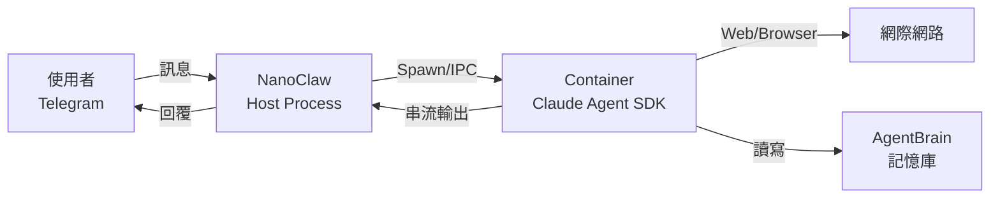
```mermaid
graph LR
    A[使用者<br>Telegram] -->|訊息| B[NanoClaw<br>Host Process]
    B -->|Spawn/IPC| C[Container<br>Claude Agent SDK]
    C -->|串流輸出| B
    B -->|回覆| A
    C -->|Web/Browser| D[網際網路]
    C -->|讀寫| E[AgentBrain<br>記憶庫]
```

---

## 2. 設計哲學

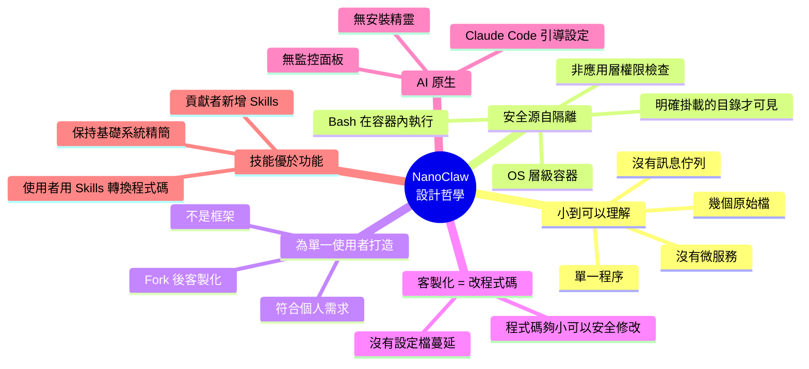
```mermaid
mindmap
  root((NanoClaw<br>設計哲學))
    小到可以理解
      單一程序
      幾個原始檔
      沒有微服務
      沒有訊息佇列
    安全源自隔離
      OS 層級容器
      非應用層權限檢查
      明確掛載的目錄才可見
      Bash 在容器內執行
    為單一使用者打造
      不是框架
      符合個人需求
      Fork 後客製化
    客製化 = 改程式碼
      沒有設定檔蔓延
      程式碼夠小可以安全修改
    AI 原生
      Claude Code 引導設定
      無安裝精靈
      無監控面板
    技能優於功能
      貢獻者新增 Skills
      使用者用 Skills 轉換程式碼
      保持基礎系統精簡
```

| 原則 | 說明 |
|------|------|
| **小到可以理解** | 單一程序，少數原始檔，無微服務、無訊息佇列、無抽象層 |
| **安全源自隔離** | Agent 在 Docker 容器中執行，只能看到明確掛載的目錄 |
| **為單一使用者打造** | 這不是框架，是為個人需求量身訂做的軟體 |
| **客製化 = 改程式碼** | 不搞設定檔蔓延，程式碼夠小可以直接改 |
| **AI 原生開發** | 用 Claude Code 引導設定、除錯、客製化 |
| **技能優於功能** | 貢獻者提交 Skills（如 `/add-gmail`）而非在基礎系統加功能 |

---

## 3. 整體架構

### 3.1 系統架構圖

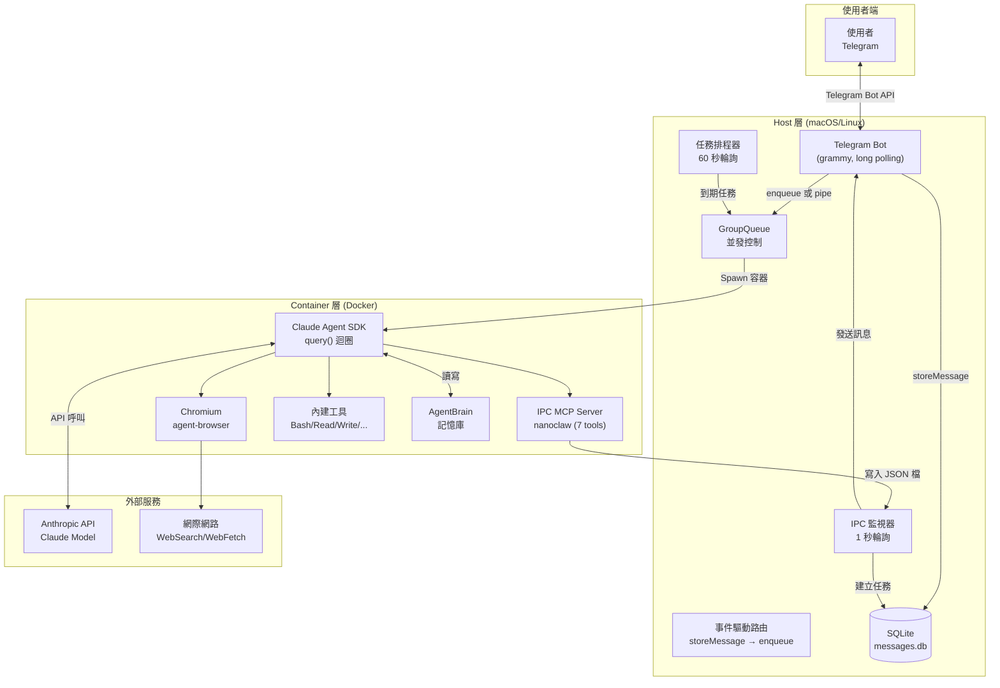
```mermaid
graph TB
    subgraph "使用者端"
        Phone["使用者<br>Telegram"]
    end

    subgraph "Host 層 (macOS/Linux)"
        TG["Telegram Bot<br>(grammy, long polling)"]
        Router["事件驅動路由<br>storeMessage → enqueue"]
        Scheduler["任務排程器<br>60 秒輪詢"]
        IPC["IPC 監視器<br>1 秒輪詢"]
        Queue["GroupQueue<br>並發控制"]
        DB[(SQLite<br>messages.db)]
    end

    subgraph "Container 層 (Docker)"
        Agent["Claude Agent SDK<br>query() 迴圈"]
        MCP["IPC MCP Server<br>nanoclaw (7 tools)"]
        Browser["Chromium<br>agent-browser"]
        Tools["內建工具<br>Bash/Read/Write/..."]
        Brain["AgentBrain<br>記憶庫"]
    end

    subgraph "外部服務"
        Claude["Anthropic API<br>Claude Model"]
        Web["網際網路<br>WebSearch/WebFetch"]
    end

    Phone <-->|Telegram Bot API| TG
    TG -->|storeMessage| DB
    TG -->|enqueue 或 pipe| Queue
    Queue -->|Spawn 容器| Agent
    Scheduler -->|到期任務| Queue
    Agent <-->|API 呼叫| Claude
    Agent --> Tools
    Agent --> Browser
    Browser --> Web
    Agent --> MCP
    Agent <-->|讀寫| Brain
    MCP -->|寫入 JSON 檔| IPC
    IPC -->|發送訊息| TG
    IPC -->|建立任務| DB
```

### 3.2 分層架構

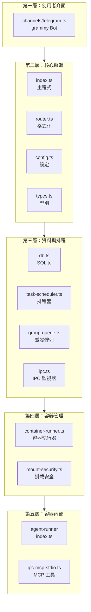
```mermaid
graph TB
    subgraph L1["第一層：使用者介面"]
        Telegram["channels/telegram.ts<br>grammy Bot"]
    end

    subgraph L2["第二層：核心邏輯"]
        Index["index.ts<br>主程式"]
        RouterM["router.ts<br>格式化"]
        Config["config.ts<br>設定"]
        Types["types.ts<br>型別"]
    end

    subgraph L3["第三層：資料與排程"]
        DB2["db.ts<br>SQLite"]
        TaskSched["task-scheduler.ts<br>排程器"]
        GQueue["group-queue.ts<br>並發佇列"]
        IPCM["ipc.ts<br>IPC 監視器"]
    end

    subgraph L4["第四層：容器管理"]
        CRunner["container-runner.ts<br>容器執行器"]
        MSec["mount-security.ts<br>掛載安全"]
    end

    subgraph L5["第五層：容器內部"]
        ARunner["agent-runner<br>index.ts"]
        IPCMCP["ipc-mcp-stdio.ts<br>MCP 工具"]
    end

    L1 --> L2
    L2 --> L3
    L3 --> L4
    L4 --> L5
```

### 3.3 v1 → v2 主要變更

| 項目 | v1 | v2 |
|------|-----|-----|
| IM 介面 | WhatsApp (baileys) | **Telegram Bot (grammy)** |
| 訊息處理 | 輪詢迴圈 | **事件驅動** |
| 使用者模式 | 多群組 + 觸發詞 | **單一使用者，無觸發詞** |
| 容器生命週期 | 每次查詢結束即銷毀 | **多輪：容器保持存活** |
| 輸出方式 | 單一結構化 JSON | **多次串流輸出** |
| 重播偵測 | Phase flag (replaying/processing) | **UUID-based Set** |
| 記憶系統 | CLAUDE.md only | **AgentBrain vault** |
| Session 管理 | 無重設機制 | **new_session MCP tool** |

---

## 4. 目錄結構

```
nanoclaw/
├── src/                          # 主機端原始碼 (3,604 行)
│   ├── index.ts                  # 主程式：路由、排程、IPC (385 行)
│   ├── channels/
│   │   └── telegram.ts           # grammy Bot：long polling、typing、訊息切割 (170 行)
│   ├── config.ts                 # 設定常數 (57 行)
│   ├── types.ts                  # TypeScript 介面 (91 行)
│   ├── db.ts                     # SQLite 資料庫層 (433 行)
│   ├── router.ts                 # XML 格式化、internal tag 處理 (44 行)
│   ├── container-runner.ts       # 容器生成與串流輸出解析 (585 行)
│   ├── ipc.ts                    # IPC 監視器：訊息/任務/session (208 行)
│   ├── task-scheduler.ts         # 排程任務執行 (190 行)
│   ├── group-queue.ts            # 並發控制 + 多輪容器管理 (302 行)
│   ├── mount-security.ts         # 掛載白名單驗證 (402 行)
│   ├── env.ts                    # .env 檔案讀取 (40 行)
│   └── logger.ts                 # Pino 日誌 (16 行)
│
├── container/                    # 容器相關
│   ├── Dockerfile                # 容器映像定義
│   ├── build.sh                  # 建構腳本
│   └── agent-runner/             # 容器內執行的程式碼 (999 行)
│       ├── package.json
│       ├── tsconfig.json
│       └── src/
│           ├── index.ts          # Agent 進入點：query 迴圈、記憶載入 (753 行)
│           └── ipc-mcp-stdio.ts  # MCP Server：7 個工具 (246 行)
│
├── AgentBrain/                   # Obsidian 相容記憶庫（git submodule）
│   ├── agentmind/                # soul.md, identity.md, evolution/
│   ├── memory/                   # user.md, tool.md, context.md, memory.md, daily/
│   └── knowledge/                # 知識筆記，wiki-link 連結
│
├── groups/main/                  # Agent 工作空間（掛載 → /workspace/group）
│   ├── CLAUDE.md                 # Agent 的系統指示和持久記憶
│   ├── conversations/            # PreCompact hook 自動歸檔的對話
│   ├── logs/                     # 每次容器執行的日誌
│   └── .claude/skills/           # Agent SDK 自動載入的技能
│
├── store/messages.db             # SQLite 資料庫
├── data/
│   ├── ipc/main/                 # IPC：messages/, tasks/, input/
│   ├── sessions/main/.claude/    # Agent SDK Session 紀錄
│   └── env/                      # （Legacy — secrets 已改為 stdin 傳遞）
│
├── docs/                         # 技術文件
│   ├── REQUIREMENTS.md           # 架構決策
│   ├── SECURITY.md               # 安全模型
│   └── message-system-design.md  # 訊息系統設計文件
│
├── .claude/skills/               # Claude Code Skills（開發用）
├── CLAUDE.md                     # Claude Code 專案指示
└── README.md
```

---

## 5. 核心元件詳解

### 5.1 主程式 index.ts

**檔案路徑**：`src/index.ts`（385 行）

系統的心臟，負責訊息處理管線和所有子系統的協調。v2 採用**事件驅動**架構：Telegram 事件直接觸發處理，不再使用輪詢迴圈。

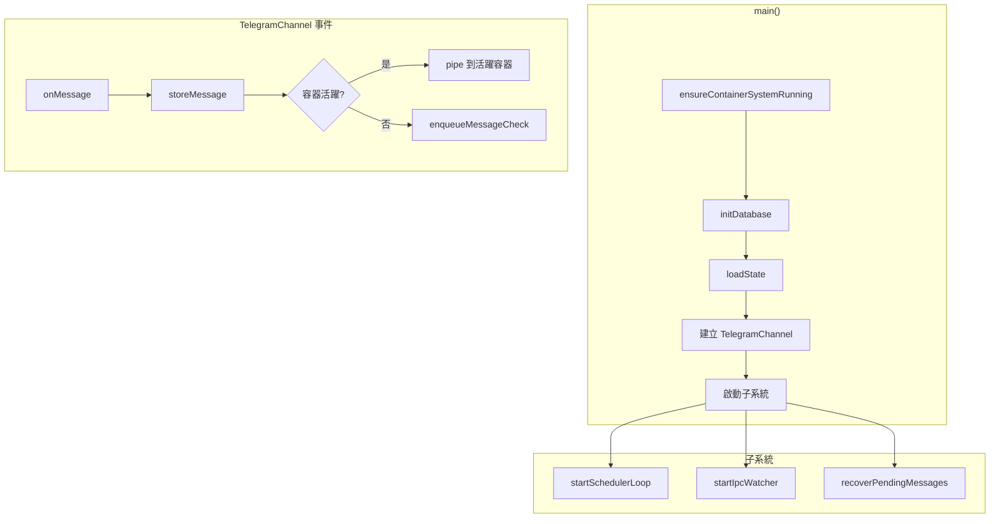
```mermaid
graph TB
    subgraph "main()"
        A[ensureContainerSystemRunning] --> B[initDatabase]
        B --> C[loadState]
        C --> D[建立 TelegramChannel]
        D --> E[啟動子系統]
    end

    subgraph "TelegramChannel 事件"
        F["onMessage"] --> G[storeMessage]
        G --> H{容器活躍?}
        H -->|是| I[pipe 到活躍容器]
        H -->|否| J[enqueueMessageCheck]
    end

    subgraph "子系統"
        E --> K[startSchedulerLoop]
        E --> L[startIpcWatcher]
        E --> M[recoverPendingMessages]
    end
```

#### 主要函式

| 函式 | 說明 |
|------|------|
| `main()` | 進入點：確認容器系統、初始化 DB、載入狀態、建立 Telegram 頻道 |
| `processMessages(chatJid)` | 讀取未處理訊息 → 格式化 XML → 呼叫 `runAgent()` → 處理串流輸出 |
| `runAgent(prompt, chatJid, onOutput)` | 生成容器、管理 Session、傳遞串流結果回呼 |
| `loadState()` / `saveState()` | 從 SQLite 載入/儲存 `lastAgentTimestamp` 和 `sessions` |
| `recoverPendingMessages()` | 啟動恢復：檢查崩潰期間未處理的訊息 |

#### 訊息處理管線（processMessages）

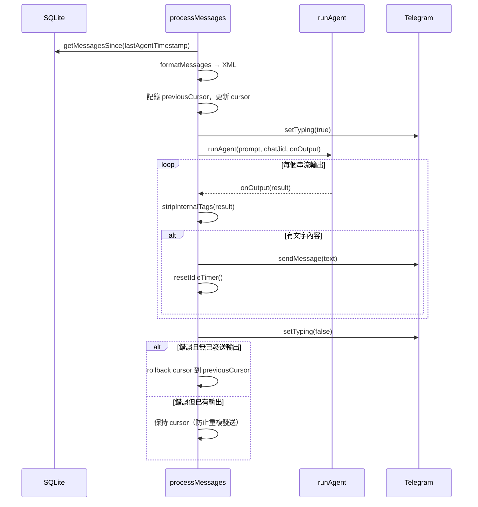
```mermaid
sequenceDiagram
    participant DB as SQLite
    participant PM as processMessages
    participant Agent as runAgent
    participant TG as Telegram

    PM->>DB: getMessagesSince(lastAgentTimestamp)
    PM->>PM: formatMessages → XML
    PM->>PM: 記錄 previousCursor，更新 cursor
    PM->>TG: setTyping(true)

    PM->>Agent: runAgent(prompt, chatJid, onOutput)

    loop 每個串流輸出
        Agent-->>PM: onOutput(result)
        PM->>PM: stripInternalTags(result)
        alt 有文字內容
            PM->>TG: sendMessage(text)
            PM->>PM: resetIdleTimer()
        end
    end

    PM->>TG: setTyping(false)

    alt 錯誤且無已發送輸出
        PM->>PM: rollback cursor 到 previousCursor
    else 錯誤但已有輸出
        PM->>PM: 保持 cursor（防止重複發送）
    end
```

#### 事件驅動入口

```typescript
// TelegramChannel onMessage 回呼
onMessage: (chatJid, msg) => {
  if (chatJid !== OWNER_CHAT_JID) return;  // 只處理 owner 訊息
  storeMessage(msg);

  // 嘗試 pipe 到活躍容器，否則排入佇列啟動新容器
  if (queue.sendMessage(chatJid, formatted)) {
    // 直接注入到活躍容器
  } else {
    queue.enqueueMessageCheck(chatJid);
  }
}
```

---

### 5.2 Telegram 頻道 telegram.ts

**檔案路徑**：`src/channels/telegram.ts`（170 行）

使用 grammy 框架實作 Telegram Bot，透過 Long Polling 接收訊息。

#### 核心功能

| 功能 | 說明 |
|------|------|
| Long Polling | `bot.start()` 持續拉取訊息，無需 Webhook |
| 訊息切割 | 超過 4096 字元自動分割為多條訊息 |
| Typing 指示器 | 每 4.5 秒重複發送（Telegram 5 秒後自動過期） |
| IPv4 強制 | `https.Agent({ family: 4 })` 避免 IPv6 問題 |

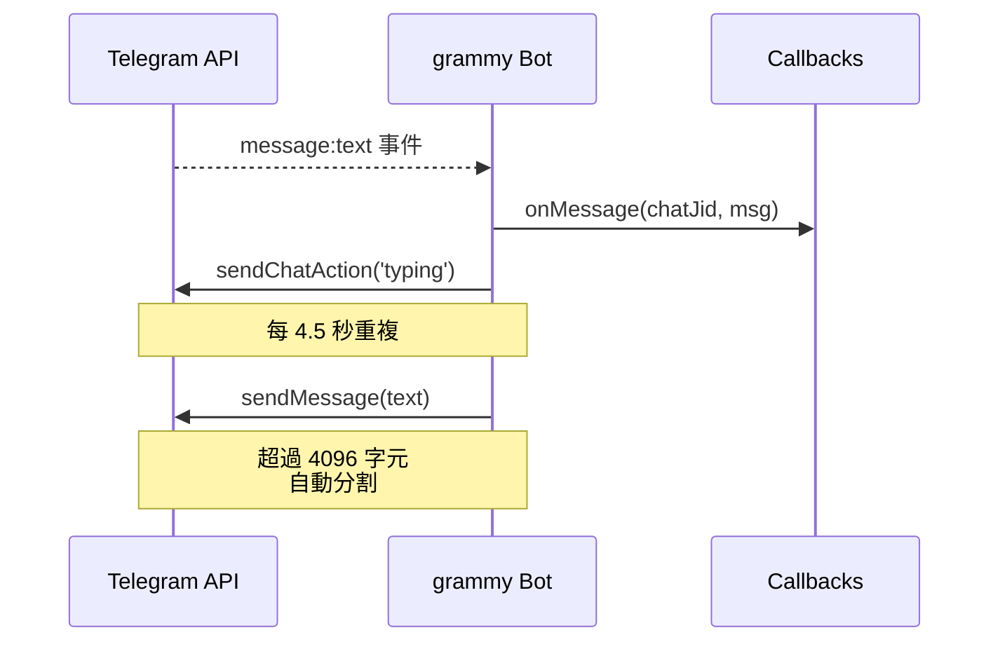
```mermaid
sequenceDiagram
    participant TG as Telegram API
    participant Bot as grammy Bot
    participant CB as Callbacks

    TG-->>Bot: message:text 事件
    Bot->>CB: onMessage(chatJid, msg)

    Bot->>TG: sendChatAction('typing')
    Note over Bot,TG: 每 4.5 秒重複

    Bot->>TG: sendMessage(text)
    Note over Bot,TG: 超過 4096 字元<br>自動分割
```

---

### 5.3 設定檔 config.ts

**檔案路徑**：`src/config.ts`（57 行）

集中管理所有設定常數，支援環境變數覆蓋。

| 常數 | 預設值 | 說明 |
|------|--------|------|
| `ASSISTANT_NAME` | `'Cal'` | 助理名稱 |
| `OWNER_CHAT_JID` | — (必填) | Owner 的 Telegram Chat ID |
| `AGENT_MODEL` | `'claude-sonnet-4-6'` | Claude 模型 |
| `CONTAINER_TIMEOUT` | `1800000` ms (30 分鐘) | 容器執行超時 |
| `IDLE_TIMEOUT` | `1800000` ms (30 分鐘) | 閒置超時（關閉容器） |
| `MAX_CONCURRENT_CONTAINERS` | `5` | 最大同時容器數 |
| `IPC_POLL_INTERVAL` | `1000` ms | IPC 掃描間隔 |
| `SCHEDULER_POLL_INTERVAL` | `60000` ms | 排程器輪詢間隔 |
| `CONTAINER_IMAGE` | `'nanoclaw-agent:latest'` | 容器映像名稱 |
| `CONTAINER_MAX_OUTPUT_SIZE` | `10485760` (10MB) | 容器輸出大小上限 |

---

### 5.4 型別定義 types.ts

**檔案路徑**：`src/types.ts`（91 行）

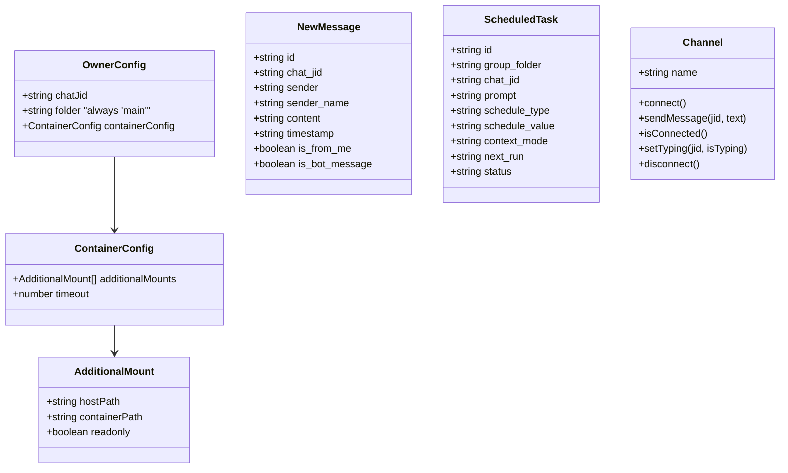
```mermaid
classDiagram
    class OwnerConfig {
        +string chatJid
        +string folder "always 'main'"
        +ContainerConfig containerConfig
    }

    class ContainerConfig {
        +AdditionalMount[] additionalMounts
        +number timeout
    }

    class AdditionalMount {
        +string hostPath
        +string containerPath
        +boolean readonly
    }

    class NewMessage {
        +string id
        +string chat_jid
        +string sender
        +string sender_name
        +string content
        +string timestamp
        +boolean is_from_me
        +boolean is_bot_message
    }

    class ScheduledTask {
        +string id
        +string group_folder
        +string chat_jid
        +string prompt
        +string schedule_type
        +string schedule_value
        +string context_mode
        +string next_run
        +string status
    }

    class Channel {
        +string name
        +connect()
        +sendMessage(jid, text)
        +isConnected()
        +setTyping(jid, isTyping)
        +disconnect()
    }

    OwnerConfig --> ContainerConfig
    ContainerConfig --> AdditionalMount
```

---

### 5.5 資料庫層 db.ts

**檔案路徑**：`src/db.ts`（433 行）

使用 `better-sqlite3` 管理所有持久化資料。

#### 資料表結構

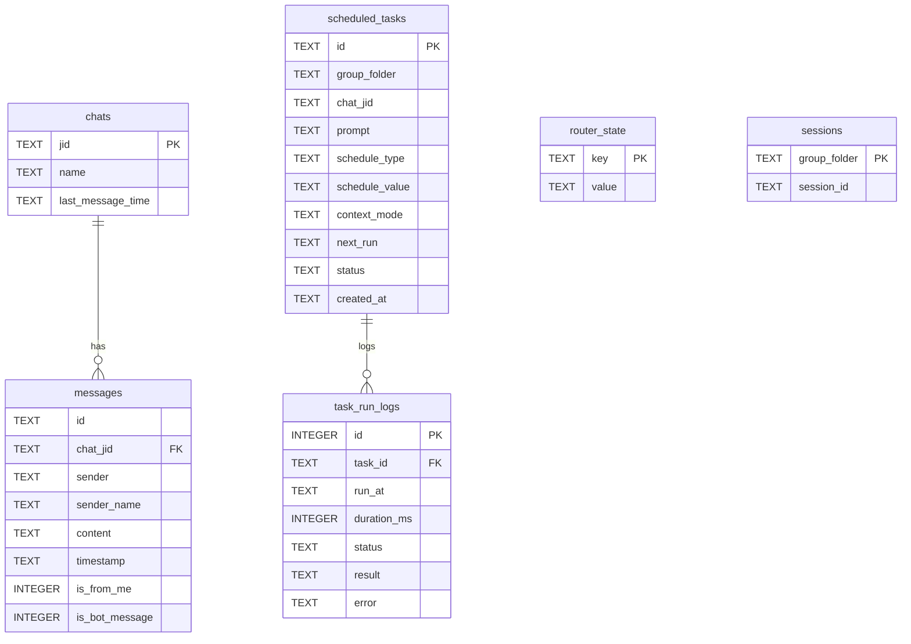
```mermaid
erDiagram
    chats {
        TEXT jid PK
        TEXT name
        TEXT last_message_time
    }

    messages {
        TEXT id
        TEXT chat_jid FK
        TEXT sender
        TEXT sender_name
        TEXT content
        TEXT timestamp
        INTEGER is_from_me
        INTEGER is_bot_message
    }

    scheduled_tasks {
        TEXT id PK
        TEXT group_folder
        TEXT chat_jid
        TEXT prompt
        TEXT schedule_type
        TEXT schedule_value
        TEXT context_mode
        TEXT next_run
        TEXT status
        TEXT created_at
    }

    task_run_logs {
        INTEGER id PK
        TEXT task_id FK
        TEXT run_at
        INTEGER duration_ms
        TEXT status
        TEXT result
        TEXT error
    }

    router_state {
        TEXT key PK
        TEXT value
    }

    sessions {
        TEXT group_folder PK
        TEXT session_id
    }

    chats ||--o{ messages : "has"
    scheduled_tasks ||--o{ task_run_logs : "logs"
```

#### 主要函式

| 函式 | 說明 |
|------|------|
| `initDatabase()` | 建表、執行遷移 |
| `storeMessage(msg)` | 儲存訊息（接受 NewMessage 物件，不綁定平台型別） |
| `storeChatMetadata()` | 儲存聊天元資料 |
| `getMessagesSince(chatJid, timestamp, botName)` | 取得指定時間後的訊息，**過濾 bot 自己的訊息** |
| `createTask()` / `getDueTasks()` | 排程任務 CRUD |
| `setSession()` / `getAllSessions()` | Session ID 管理 |
| `getRouterState()` / `setRouterState()` | 鍵值對狀態儲存 |

---

### 5.6 訊息路由 router.ts

**檔案路徑**：`src/router.ts`（44 行）

負責訊息格式轉換和輸出處理。

#### 核心函式

| 函式 | 說明 |
|------|------|
| `formatMessages(messages)` | 將 NewMessage[] 轉為 XML 格式 |
| `stripInternalTags(text)` | 移除 `<internal>...</internal>` 標籤 |
| `formatOutbound(rawText)` | strip internal tags 後的輸出文字 |
| `escapeXml(s)` | XML 特殊字元跳脫 |

#### XML 格式範例

```xml
<messages>
<message sender="shun" time="2026-02-17T14:32:00.000Z">今天天氣如何？</message>
<message sender="shun" time="2026-02-17T14:33:00.000Z">順便幫我查一下明天的</message>
</messages>
```

#### Internal Tags

Agent 用 `<internal>...</internal>` 標記不應發送給使用者的內容：

```
一切正常 <internal>daily log written</internal>
→ 發送給使用者：「一切正常」

<internal>reflection complete</internal>
→ 不發送任何內容
```

---

### 5.7 容器執行器 container-runner.ts

**檔案路徑**：`src/container-runner.ts`（585 行）

負責生成和管理 Agent 容器，解析串流輸出。

#### 容器掛載

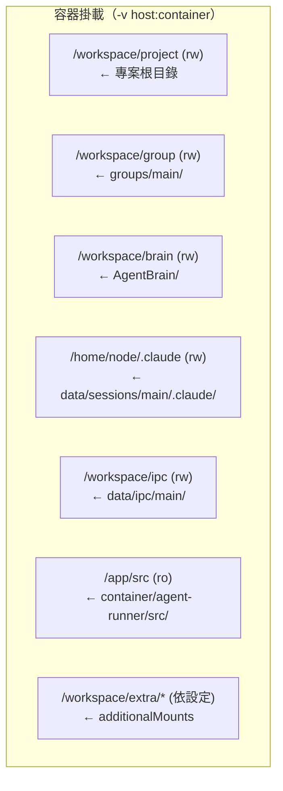
```mermaid
graph TB
    subgraph "容器掛載（-v host:container）"
        M1["/workspace/project (rw)<br>← 專案根目錄"]
        M2["/workspace/group (rw)<br>← groups/main/"]
        M3["/workspace/brain (rw)<br>← AgentBrain/"]
        M4["/home/node/.claude (rw)<br>← data/sessions/main/.claude/"]
        M5["/workspace/ipc (rw)<br>← data/ipc/main/"]
        M6["/app/src (ro)<br>← container/agent-runner/src/"]
        M7["/workspace/extra/* (依設定)<br>← additionalMounts"]
    end
```

#### 串流輸出解析

容器使用哨兵標記（Sentinel Markers）包裹每個輸出，**一次容器執行可能產生多個輸出**：

```
[... 各種 stderr/stdout ...]
---NANOCLAW_OUTPUT_START---
{"status":"success","result":"第一步完成","newSessionId":"abc123"}
---NANOCLAW_OUTPUT_END---
[... 更多工具執行 ...]
---NANOCLAW_OUTPUT_START---
{"status":"success","result":"全部完成"}
---NANOCLAW_OUTPUT_END---
```

Host 的 `onOutput` 回呼在每個 marker pair 解析後立即被呼叫，實現串流效果。

#### 容器執行流程

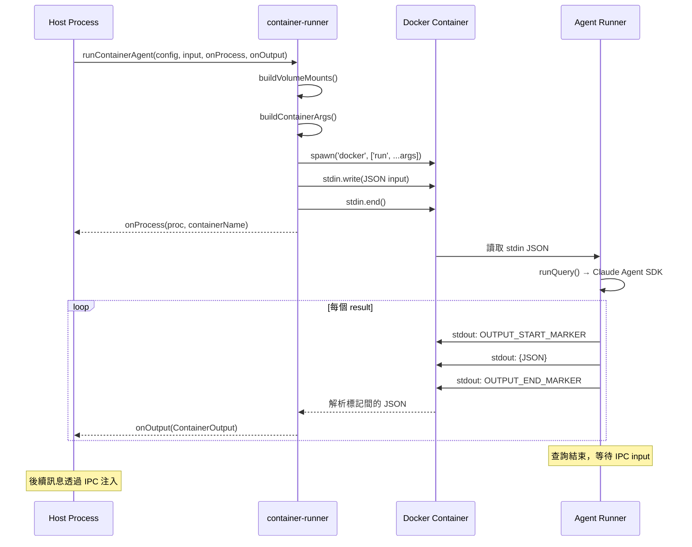
```mermaid
sequenceDiagram
    participant Host as Host Process
    participant CR as container-runner
    participant C as Docker Container
    participant Agent as Agent Runner

    Host->>CR: runContainerAgent(config, input, onProcess, onOutput)
    CR->>CR: buildVolumeMounts()
    CR->>CR: buildContainerArgs()
    CR->>C: spawn('docker', ['run', ...args])
    CR->>C: stdin.write(JSON input)
    CR->>C: stdin.end()
    CR-->>Host: onProcess(proc, containerName)

    C->>Agent: 讀取 stdin JSON
    Agent->>Agent: runQuery() → Claude Agent SDK

    loop 每個 result
        Agent->>C: stdout: OUTPUT_START_MARKER
        Agent->>C: stdout: {JSON}
        Agent->>C: stdout: OUTPUT_END_MARKER
        C-->>CR: 解析標記間的 JSON
        CR-->>Host: onOutput(ContainerOutput)
    end

    Note over Agent: 查詢結束，等待 IPC input
    Note over Host: 後續訊息透過 IPC 注入
```

#### 容器日誌

每次容器執行會在 `groups/main/logs/` 寫入日誌檔：

```
=== Container Run Log ===
Timestamp: 2026-02-17T06:07:21.464Z
Duration: 32964ms
Exit Code: 0

=== Input Summary ===
Prompt length: 102 chars
Session ID: 639eb607-...

=== Mounts ===
/workspace/project → /Users/.../nanoclaw
/workspace/group → /Users/.../groups/main

=== Agent Responses (2 outputs) ===
[1] (45 chars)
我很好啊！今天有什麼想聊的嗎？
---
[2] (28 chars)
好的，已經完成了。
```

---

### 5.8 IPC 監視器 ipc.ts

**檔案路徑**：`src/ipc.ts`（208 行）

每 1 秒輪詢 `data/ipc/main/` 目錄，處理容器寫入的 JSON 檔案。

#### IPC 類型

| 目錄 | 類型 | 處理方式 |
|------|------|----------|
| `messages/` | `send_message` | `stripInternalTags` → `sendMessage()` 到 Telegram |
| `tasks/` | `schedule_task` | 驗證 → `createTask()` 寫入 SQLite |
| `tasks/` | `pause_task` | `updateTaskStatus('paused')` |
| `tasks/` | `resume_task` | `updateTaskStatus('active')` |
| `tasks/` | `cancel_task` | `deleteTask()` |
| `tasks/` | `new_session` | `setSession(folder, '')` 清除 Session |

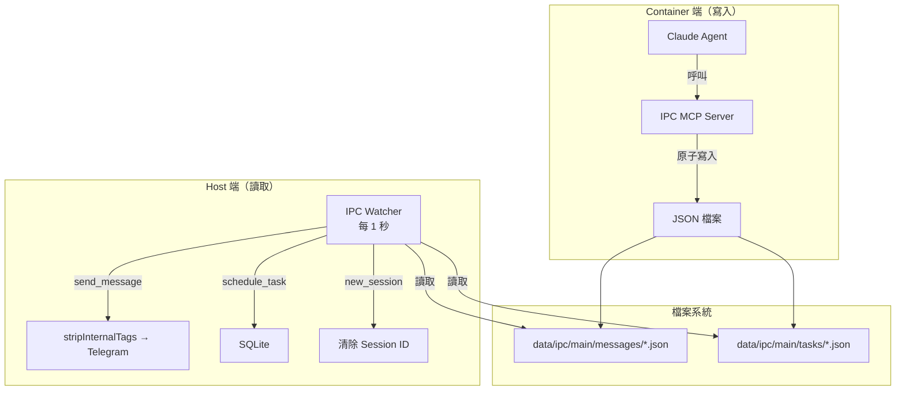
```mermaid
graph TB
    subgraph "Container 端（寫入）"
        Agent["Claude Agent"] -->|呼叫| MCP["IPC MCP Server"]
        MCP -->|原子寫入| Files["JSON 檔案"]
    end

    subgraph "檔案系統"
        Files --> MsgDir["data/ipc/main/messages/*.json"]
        Files --> TaskDir["data/ipc/main/tasks/*.json"]
    end

    subgraph "Host 端（讀取）"
        Watcher["IPC Watcher<br>每 1 秒"] -->|讀取| MsgDir
        Watcher -->|讀取| TaskDir
        Watcher -->|send_message| TG["stripInternalTags → Telegram"]
        Watcher -->|schedule_task| DB["SQLite"]
        Watcher -->|new_session| Session["清除 Session ID"]
    end
```

---

### 5.9 任務排程器 task-scheduler.ts

**檔案路徑**：`src/task-scheduler.ts`（190 行）

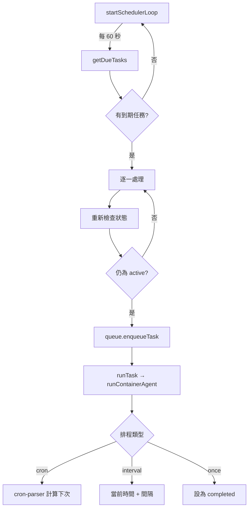
```mermaid
graph TB
    A[startSchedulerLoop] -->|每 60 秒| B[getDueTasks]
    B --> C{有到期任務?}
    C -->|否| A
    C -->|是| D[逐一處理]
    D --> E[重新檢查狀態]
    E --> F{仍為 active?}
    F -->|否| D
    F -->|是| G[queue.enqueueTask]
    G --> H[runTask → runContainerAgent]
    H --> I{排程類型}
    I -->|cron| J[cron-parser 計算下次]
    I -->|interval| K[當前時間 + 間隔]
    I -->|once| L[設為 completed]
```

#### 排程類型

| 類型 | 格式範例 | 說明 |
|------|----------|------|
| `cron` | `"0 9 * * *"` | 每天早上 9 點（本地時區） |
| `interval` | `"3600000"` | 每小時（毫秒） |
| `once` | `"2026-02-01T15:30:00"` | 一次性，指定本地時間（無 Z 後綴） |

#### 上下文模式

| 模式 | 說明 | 適用場景 |
|------|------|----------|
| `group` | 使用群組當前 Session | 需要對話歷史的任務 |
| `isolated` | 全新 Session | 獨立任務，所有上下文在 prompt 中 |

---

### 5.10 群組佇列 group-queue.ts

**檔案路徑**：`src/group-queue.ts`（302 行）

管理容器並發和多輪容器的生命週期。

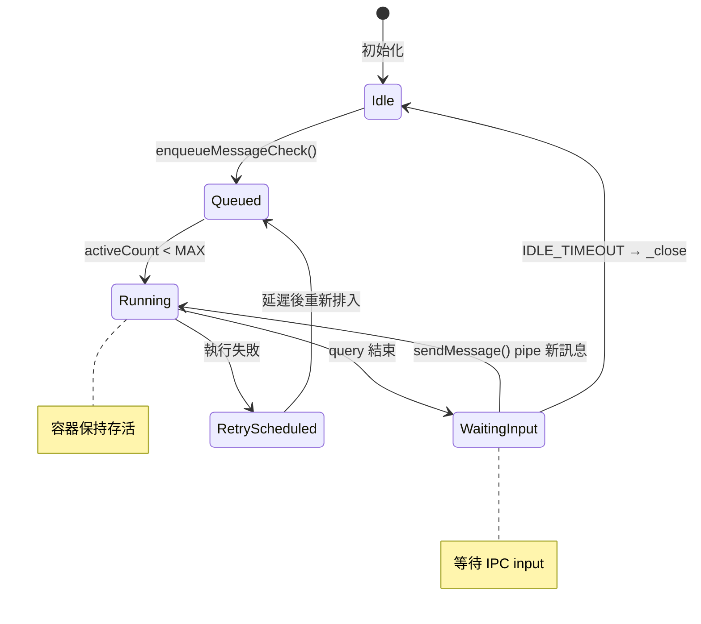
```mermaid
stateDiagram-v2
    [*] --> Idle: 初始化

    Idle --> Queued: enqueueMessageCheck()
    Queued --> Running: activeCount < MAX

    Running --> WaitingInput: query 結束
    WaitingInput --> Running: sendMessage() pipe 新訊息
    WaitingInput --> Idle: IDLE_TIMEOUT → _close

    Running --> RetryScheduled: 執行失敗
    RetryScheduled --> Queued: 延遲後重新排入

    note right of Running : 容器保持存活
    note right of WaitingInput : 等待 IPC input
```

#### 多輪容器管理

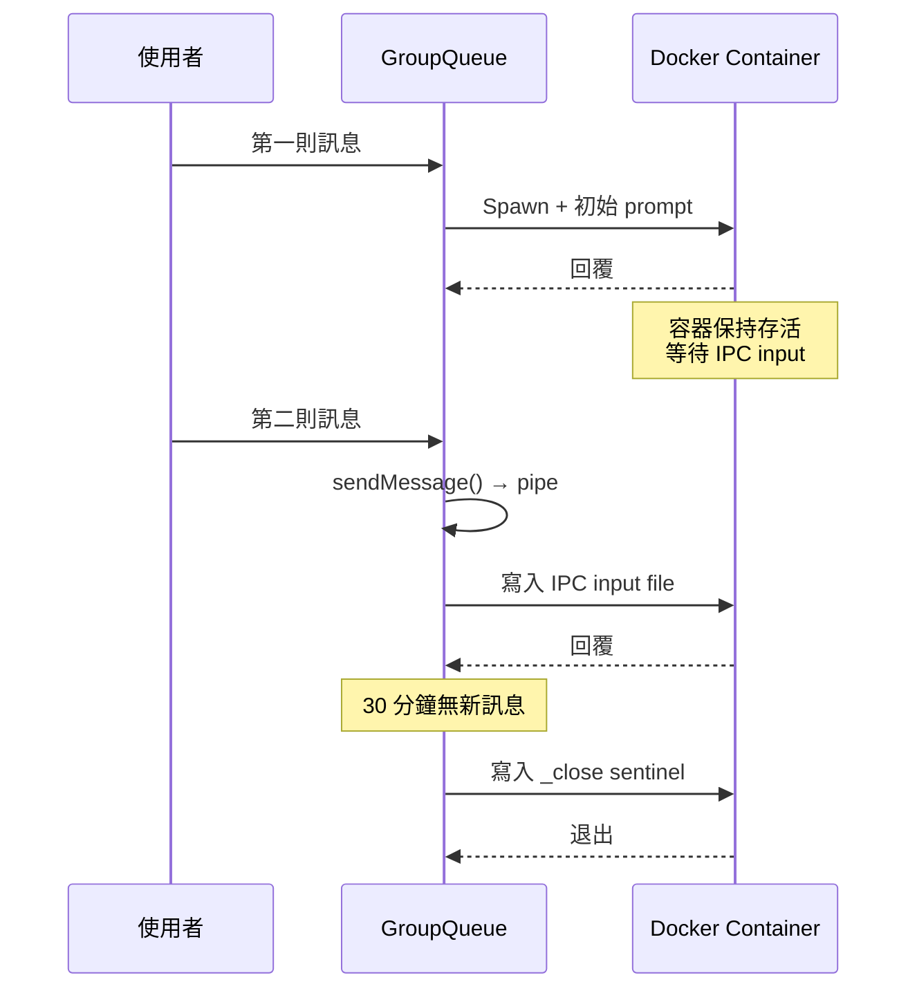
```mermaid
sequenceDiagram
    participant User as 使用者
    participant Queue as GroupQueue
    participant Container as Docker Container

    User->>Queue: 第一則訊息
    Queue->>Container: Spawn + 初始 prompt
    Container-->>Queue: 回覆

    Note over Container: 容器保持存活<br>等待 IPC input

    User->>Queue: 第二則訊息
    Queue->>Queue: sendMessage() → pipe
    Queue->>Container: 寫入 IPC input file
    Container-->>Queue: 回覆

    Note over Queue: 30 分鐘無新訊息
    Queue->>Container: 寫入 _close sentinel
    Container-->>Queue: 退出
```

#### 重試機制

使用**指數退避**（Exponential Backoff）：

```
第 1 次重試: 5,000 ms
第 2 次重試: 10,000 ms
第 3 次重試: 20,000 ms
第 4 次重試: 40,000 ms
第 5 次重試: 80,000 ms
超過 5 次: 放棄
```

---

### 5.11 掛載安全模組 mount-security.ts

**檔案路徑**：`src/mount-security.ts`（402 行）

驗證額外掛載是否符合外部白名單的安全規則。

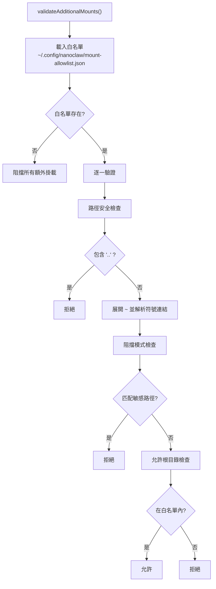
```mermaid
graph TB
    A["validateAdditionalMounts()"] --> B["載入白名單<br>~/.config/nanoclaw/mount-allowlist.json"]
    B --> C{白名單存在?}
    C -->|否| D["阻擋所有額外掛載"]
    C -->|是| E["逐一驗證"]

    E --> F["路徑安全檢查"]
    F --> G{包含 '..' ?}
    G -->|是| H["拒絕"]
    G -->|否| I["展開 ~ 並解析符號連結"]
    I --> J["阻擋模式檢查"]
    J --> K{匹配敏感路徑?}
    K -->|是| L["拒絕"]
    K -->|否| M["允許根目錄檢查"]
    M --> N{在白名單內?}
    N -->|是| O["允許"]
    N -->|否| P["拒絕"]
```

#### 永遠阻擋的路徑模式

```
.ssh, .gnupg, .gpg, .aws, .azure, .gcloud, .kube, .docker,
credentials, .env, .netrc, .npmrc, .pypirc,
id_rsa, id_ed25519, private_key, .secret
```

---

### 5.12 日誌模組 logger.ts

**檔案路徑**：`src/logger.ts`（16 行）

使用 Pino JSON 結構化日誌：

```typescript
import pino from 'pino';

export const logger = pino({
  level: process.env.LOG_LEVEL || 'info',
  transport: { target: 'pino-pretty', options: { colorize: true } },
});
```

可透過 `LOG_LEVEL=debug` 啟用詳細日誌。

---

## 6. Container 機制

### 6.1 Dockerfile

**檔案路徑**：`container/Dockerfile`

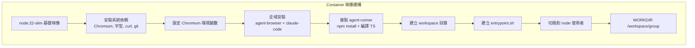
```mermaid
graph TB
    subgraph "Container 映像建構"
        A["node:22-slim 基礎映像"] --> B["安裝系統依賴<br>Chromium, 字型, curl, git"]
        B --> C["設定 Chromium 環境變數"]
        C --> D["全域安裝<br>agent-browser + claude-code"]
        D --> E["複製 agent-runner<br>npm install + 編譯 TS"]
        E --> F["建立 workspace 目錄"]
        F --> G["建立 entrypoint.sh"]
        G --> H["切換到 node 使用者"]
        H --> I["WORKDIR /workspace/group"]
    end
```

#### 容器內的目錄結構

```
/
├── app/                         # Agent Runner 程式碼
│   ├── dist/index.js           # 編譯後的進入點
│   ├── dist/ipc-mcp-stdio.js   # MCP Server
│   └── entrypoint.sh           # 進入點腳本
├── workspace/
│   ├── project/                # 專案根目錄
│   ├── group/                  # 群組資料夾（工作目錄 + CLAUDE.md）
│   ├── brain/                  # AgentBrain 記憶庫
│   ├── extra/                  # 額外掛載
│   └── ipc/                    # IPC 通訊
│       ├── messages/           # send_message 輸出
│       ├── tasks/              # schedule/pause/resume/cancel/new_session
│       └── input/              # Host → Container 後續訊息
├── home/node/.claude/           # Claude Session 資料
└── usr/bin/chromium              # Chromium 瀏覽器
```

---

### 6.2 Agent Runner

**檔案路徑**：`container/agent-runner/src/index.ts`（753 行）

容器內的核心程式碼。v2 最大的變化是**多輪查詢迴圈**和 **UUID-based 重播偵測**。

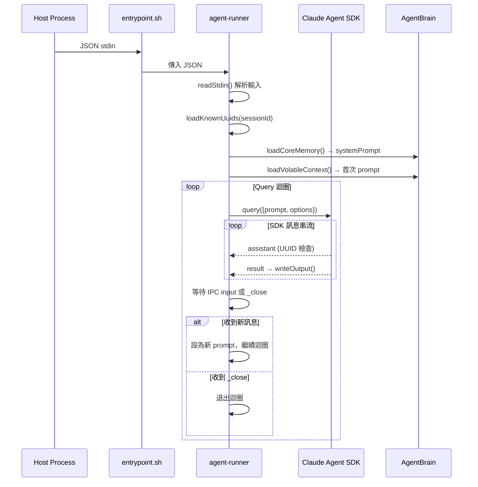
```mermaid
sequenceDiagram
    participant Host as Host Process
    participant Entry as entrypoint.sh
    participant Runner as agent-runner
    participant SDK as Claude Agent SDK
    participant Brain as AgentBrain

    Host->>Entry: JSON stdin
    Entry->>Runner: 傳入 JSON

    Runner->>Runner: readStdin() 解析輸入
    Runner->>Runner: loadKnownUuids(sessionId)
    Runner->>Brain: loadCoreMemory() → systemPrompt
    Runner->>Brain: loadVolatileContext() → 首次 prompt

    loop Query 迴圈
        Runner->>SDK: query({prompt, options})

        loop SDK 訊息串流
            SDK-->>Runner: assistant (UUID 檢查)
            SDK-->>Runner: result → writeOutput()
        end

        Runner->>Runner: 等待 IPC input 或 _close
        alt 收到新訊息
            Runner->>Runner: 設為新 prompt，繼續迴圈
        else 收到 _close
            Runner->>Runner: 退出迴圈
        end
    end
```

#### UUID-based 重播偵測

Session resume 時，SDK 會重播舊的 assistant 訊息。v2 使用 UUID Set 過濾：

```mermaid
graph TB
    A[Container 啟動] --> B[loadKnownUuids<br>從 transcript 載入已知 UUID]
    B --> C[query() 開始]

    C --> D{收到 assistant 訊息}
    D --> E{UUID 在 knownUuids 中?}
    E -->|是| F[跳過（重播）]
    E -->|否| G[加入 knownUuids]
    G --> H[提取文字作為 fallback]

    D --> I{收到 result 訊息}
    I --> J{result.result 有值?}
    J -->|是| K[使用 result.result]
    J -->|否| L{lastAssistantText 有值?}
    L -->|是| M[使用 assistant-fallback]
    L -->|否| N[輸出 null]
    K --> O[writeOutput]
    M --> O
```

#### 多輪查詢迴圈

```typescript
// 簡化的查詢迴圈邏輯
while (true) {
  queryNumber++;
  const result = await runQuery(prompt, sessionId, ...);

  // _close sentinel → 退出
  if (result.closedDuringQuery) break;

  // 等待下一個 IPC 訊息
  const nextMessage = await waitForIpcMessage();
  if (nextMessage === null) break;  // _close

  prompt = nextMessage;
  sessionId = result.newSessionId;
}
```

#### Agent 可用工具

| 工具 | 說明 |
|------|------|
| `Bash` | 在容器內執行 Shell 命令 |
| `Read` / `Write` / `Edit` | 檔案操作 |
| `Glob` / `Grep` | 檔案搜尋 |
| `WebSearch` / `WebFetch` | 網路搜尋和抓取 |
| `Task` / `TaskOutput` / `TaskStop` | Agent Teams 子任務 |
| `TeamCreate` / `TeamDelete` / `SendMessage` | Agent Teams 團隊管理 |
| `mcp__nanoclaw__*` | IPC 工具（7 個） |

#### AgentBrain 記憶載入

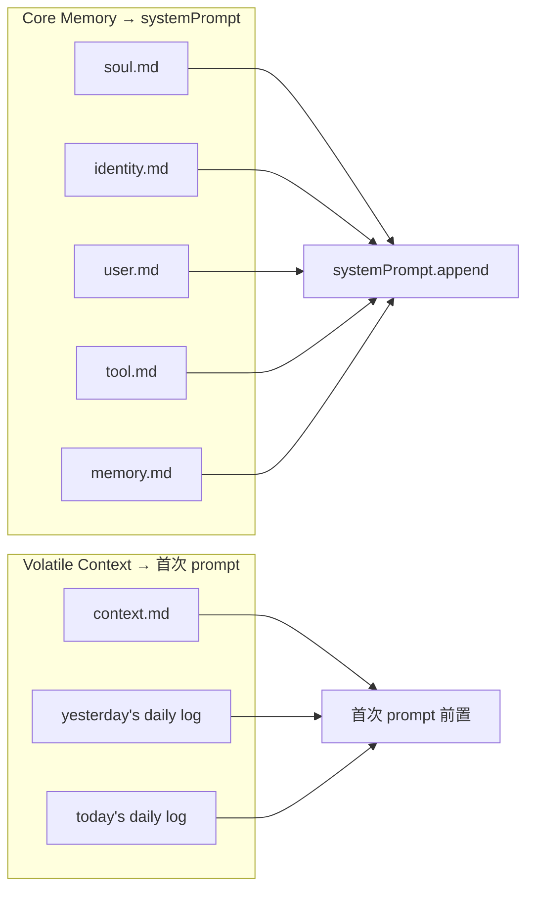
```mermaid
graph LR
    subgraph "Core Memory → systemPrompt"
        S1["soul.md"]
        S2["identity.md"]
        S3["user.md"]
        S4["tool.md"]
        S5["memory.md"]
    end

    subgraph "Volatile Context → 首次 prompt"
        V1["context.md"]
        V2["yesterday's daily log"]
        V3["today's daily log"]
    end

    S1 & S2 & S3 & S4 & S5 --> SP["systemPrompt.append"]
    V1 & V2 & V3 --> FP["首次 prompt 前置"]
```

- **Core Memory** 注入 `systemPrompt`（穩定，可被 prompt cache）
- **Volatile Context** 只在新 session 的首次 prompt 注入（session resume 時不注入）

#### Hooks

| Hook | 觸發時機 | 功能 |
|------|----------|------|
| `PreCompact` | Session 壓縮前 | 歸檔完整對話到 `conversations/` |
| `PreToolUse` (Bash) | Bash 工具呼叫前 | 在命令前加 `unset` 防止洩漏 API 金鑰 |

---

### 6.3 IPC MCP Server

**檔案路徑**：`container/agent-runner/src/ipc-mcp-stdio.ts`（246 行）

獨立的 MCP（Model Context Protocol）stdio 進程，提供 7 個工具。

```mermaid
graph TB
    subgraph "IPC MCP 工具"
        SM["send_message<br>立即發送訊息"]
        ST["schedule_task<br>排程任務"]
        LT["list_tasks<br>列出任務"]
        PT["pause_task<br>暫停任務"]
        RT["resume_task<br>恢復任務"]
        CT["cancel_task<br>取消任務"]
        NS["new_session<br>重設 Session"]
    end

    subgraph "IPC 檔案"
        MD["/workspace/ipc/messages/"]
        TD["/workspace/ipc/tasks/"]
    end

    SM -->|寫入 JSON| MD
    ST & PT & RT & CT & NS -->|寫入 JSON| TD
    LT -->|讀取| TF["/workspace/ipc/current_tasks.json"]
```

#### 工具說明

| 工具 | 說明 |
|------|------|
| `send_message` | 立即發訊息給使用者。支援 `sender` 參數在 Telegram 顯示不同身份 |
| `schedule_task` | 排程任務。驗證 cron/interval/once 格式。支援 `context_mode` |
| `list_tasks` | 從 `current_tasks.json` 讀取目前所有任務 |
| `pause_task` | 暫停任務 |
| `resume_task` | 恢復已暫停任務 |
| `cancel_task` | 取消並刪除任務 |
| `new_session` | 重設對話 Session（AgentBrain 記憶保留，僅清除 transcript） |

---

### 6.4 Container 建構流程

```bash
# 重建容器映像
./container/build.sh

# 手動測試
echo '{"prompt":"Hello","groupFolder":"test","chatJid":"123","isMain":false}' | \
  docker run -i nanoclaw-agent:latest
```

---

## 7. 訊息流程

### 7.1 完整訊息處理流程

```mermaid
sequenceDiagram
    participant User as 使用者
    participant TG as Telegram Bot API
    participant Grammy as grammy Bot
    participant DB as SQLite
    participant Queue as GroupQueue
    participant CR as container-runner
    participant Agent as Agent Runner
    participant IPC as IPC Watcher

    User->>TG: "今天天氣如何？"
    TG->>Grammy: message:text 事件
    Grammy->>DB: storeMessage()

    alt 有活躍容器
        Grammy->>Queue: sendMessage() → pipe
        Queue->>Agent: 寫入 IPC input file
        Grammy->>TG: setTyping(true)
    else 無活躍容器
        Grammy->>Queue: enqueueMessageCheck()
        Queue->>CR: processMessages()
        CR->>DB: getMessagesSince()
        CR->>CR: formatMessages → XML
        CR->>TG: setTyping(true)
        CR->>Agent: Spawn container + prompt
    end

    Agent->>Agent: runQuery() → Claude SDK
    Agent-->>CR: OUTPUT_START/END (串流)
    CR->>CR: stripInternalTags()
    CR->>TG: sendMessage("今天台北天氣...")
    TG->>User: 顯示回覆

    Note over Agent: 容器保持存活
    Note over Agent: 等待下一個 IPC input

    par IPC Watcher 持續運行
        IPC->>IPC: 每 1 秒掃描 messages/ 和 tasks/
        IPC->>TG: send_message → Telegram
        IPC->>DB: schedule_task → SQLite
    end
```

### 7.2 Cursor 管理

```mermaid
graph TB
    A[processMessages 開始] --> B[記錄 previousCursor]
    B --> C[更新 cursor 到最新訊息]
    C --> D[呼叫 runAgent]
    D --> E{結果}

    E -->|成功| F[保持新 cursor]
    E -->|錯誤 + 已發送輸出| F
    E -->|錯誤 + 無輸出| G[回滾到 previousCursor]

    F --> H[下次只處理新訊息]
    G --> I[下次重試未處理的訊息]
```

**防止重複發送**：如果已經發送了部分輸出給使用者，即使後續發生錯誤也不回滾 cursor。否則重試時使用者會收到重複訊息。

---

## 8. 多輪容器與串流輸出

### 8.1 多輪容器生命週期

```mermaid
stateDiagram-v2
    [*] --> Created: processMessages 觸發
    Created --> QueryRunning: 首次 prompt
    QueryRunning --> WaitingInput: query 結束
    WaitingInput --> QueryRunning: 收到新訊息（IPC input）
    WaitingInput --> [*]: IDLE_TIMEOUT 或 _close sentinel

    note right of QueryRunning: 多次 writeOutput
    note right of WaitingInput: 容器保持存活
```

- **容器保持存活**：首次 query 結束後，agent-runner 不退出，而是等待 IPC input
- **後續訊息**：Host 將新訊息寫入 `data/ipc/main/input/*.json`
- **優雅退出**：Host 寫入 `_close` sentinel 或 IDLE_TIMEOUT 到期時關閉

### 8.2 串流輸出機制

```mermaid
sequenceDiagram
    participant Agent as Agent Runner
    participant Host as Host Process
    participant TG as Telegram

    Note over Agent: Agent 執行多步驟任務

    Agent->>Host: OUTPUT: "讓我幫你查一下..."
    Host->>TG: sendMessage("讓我幫你查一下...")

    Note over Agent: 執行工具：WebSearch

    Agent->>Host: OUTPUT: "根據搜尋結果..."
    Host->>TG: sendMessage("根據搜尋結果...")

    Note over Agent: query 結束，等待下一訊息
```

每個 `writeOutput` 呼叫：
1. 包裹在 `OUTPUT_START_MARKER` / `OUTPUT_END_MARKER` 之間
2. Host 解析後立即呼叫 `onOutput` 回呼
3. `stripInternalTags` → 發送到 Telegram

### 8.3 IPC Input 管道

```mermaid
graph LR
    A[使用者新訊息] --> B[queue.sendMessage]
    B -->|pipe 成功| C[寫入 data/ipc/main/input/msg.json]
    C --> D[agent-runner pollIpcDuringQuery]
    D --> E[push 到 MessageStream]
    E --> F[SDK 處理新 prompt]
```

**查詢中注入**：如果 query 正在執行時收到新訊息，`pollIpcDuringQuery` 會將訊息直接 push 到 `MessageStream`，SDK 會在當前 query 中處理它。

**查詢間注入**：如果 query 已結束且 agent 在等待，`waitForIpcMessage` 會讀取新訊息，啟動新的 query。

---

## 9. IPC 通訊機制

### 9.1 雙向 IPC

```mermaid
graph TB
    subgraph "Container → Host"
        direction TB
        MCP1["send_message"] -->|寫入| MsgDir["ipc/messages/*.json"]
        MCP2["schedule_task<br>pause/resume/cancel<br>new_session"] -->|寫入| TaskDir["ipc/tasks/*.json"]
    end

    subgraph "Host → Container"
        direction TB
        Host1["sendMessage (pipe)"] -->|寫入| InputDir["ipc/input/*.json"]
        Host2["closeStdin (idle)"] -->|寫入| Close["ipc/input/_close"]
    end

    subgraph "Host → Container（快照）"
        Host3["writeTasksSnapshot"] -->|寫入| TaskSnap["ipc/current_tasks.json"]
    end
```

### 9.2 原子寫入

所有 IPC 檔案使用原子寫入防止資料損壞：

```typescript
function writeIpcFile(dir: string, data: object): string {
  const filename = `${Date.now()}-${random}.json`;
  const tempPath = `${filepath}.tmp`;

  // 先寫入臨時檔，再重命名（原子操作）
  fs.writeFileSync(tempPath, JSON.stringify(data, null, 2));
  fs.renameSync(tempPath, filepath);
}
```

---

## 10. AgentBrain 記憶體系統

### 10.1 記憶層級

```mermaid
graph TB
    subgraph "記憶層級（由穩定到動態）"
        Soul["靈魂/人格<br>agentmind/soul.md"]
        Identity["外在身份<br>agentmind/identity.md"]
        User["使用者資料<br>memory/user.md"]
        Tool["工具知識<br>memory/tool.md"]
        LTM["長期記憶<br>memory/memory.md"]
        Context["當前情境<br>memory/context.md"]
        Daily["每日筆記<br>memory/daily/YYYY-MM-DD.md"]
        Knowledge["知識庫<br>knowledge/*.md"]
    end

    Soul --> Identity --> User --> Tool --> LTM --> Context --> Daily
    Knowledge -.->|wiki-link| Knowledge
```

### 10.2 記憶載入時機

| 記憶類型 | 載入方式 | 何時載入 |
|----------|----------|----------|
| Soul, Identity, User, Tool, Memory | `systemPrompt.append` | 每次 query |
| Context, Daily logs | 首次 prompt 前置 | 僅新 session |
| Knowledge | Agent 用 Read/Glob 工具存取 | 需要時 |
| CLAUDE.md | SDK `settingSources: ['project']` | 自動 |
| Conversations | Agent 用 Read 工具存取 | 需要時 |

### 10.3 Session 重設

Agent 可透過 `new_session` MCP 工具重設對話 Session：

```mermaid
sequenceDiagram
    participant Agent as Container Agent
    participant MCP as IPC MCP
    participant IPC as IPC 檔案
    participant Host as IPC Watcher
    participant DB as SQLite

    Agent->>MCP: new_session()
    MCP->>IPC: 寫入 tasks/new_session.json
    IPC-->>Host: 讀取 new_session
    Host->>DB: setSession('main', '')
    Note over DB: Session ID 清除
    Note over Agent: 下次容器啟動時<br>開始全新 Session
```

重設範圍：
- 清除：Session transcript（對話歷史）
- **保留**：AgentBrain 所有記憶（soul, identity, user, knowledge, daily logs）

---

## 11. 排程任務系統

### 11.1 任務生命週期

```mermaid
stateDiagram-v2
    [*] --> active: schedule_task 建立

    active --> paused: pause_task
    paused --> active: resume_task

    active --> running: next_run 到期
    running --> active: cron/interval 計算下次
    running --> completed: once 類型完成

    active --> deleted: cancel_task
    paused --> deleted: cancel_task

    completed --> [*]
    deleted --> [*]
```

### 11.2 建立到執行

```mermaid
sequenceDiagram
    participant User as 使用者
    participant Agent as Container Agent
    participant MCP as IPC MCP
    participant IPC as IPC 檔案
    participant Watcher as IPC Watcher
    participant DB as SQLite
    participant Scheduler as 排程器
    participant TaskAgent as 任務 Agent

    User->>Agent: "每天早上 9 點告訴我天氣"
    Agent->>MCP: schedule_task(prompt, cron, "0 9 * * *")
    MCP->>MCP: 驗證 cron 表達式
    MCP->>IPC: 寫入 tasks/*.json

    Watcher->>IPC: 讀取 tasks/*.json
    Watcher->>DB: createTask()
    Note over DB: next_run = 明天 09:00

    Scheduler->>DB: getDueTasks() [每 60 秒]
    Note over Scheduler: 到了 09:00
    DB-->>Scheduler: 到期任務

    Scheduler->>TaskAgent: runContainerAgent
    TaskAgent->>MCP: send_message("今天天氣...")
    MCP->>IPC: messages/*.json
    Watcher->>IPC: 讀取
    Watcher->>User: Telegram 訊息

    Scheduler->>DB: updateTaskAfterRun()
    Note over DB: next_run = 後天 09:00
```

---

## 12. 安全模型

### 12.1 安全邊界

```mermaid
graph TB
    subgraph "第一道：容器隔離"
        A1["Docker 容器<br>程序和檔案系統隔離"]
        A2["只有明確掛載的目錄可見"]
        A3["非 root（node 使用者）"]
    end

    subgraph "第二道：掛載安全"
        B1["外部白名單<br>~/.config/nanoclaw/"]
        B2["敏感路徑永遠阻擋<br>.ssh, .env, credentials..."]
        B3["符號連結解析<br>防止路徑遍歷"]
    end

    subgraph "第三道：憑證處理"
        C1["API 金鑰僅透過 secrets 物件傳遞"]
        C2["PreToolUse hook 在 Bash 中 unset"]
        C3["entrypoint 刪除暫存 input.json"]
    end

    subgraph "第四道：輸出處理"
        D1["stripInternalTags<br>防止 Agent 內部資訊洩漏"]
    end
```

### 12.2 已知限制

> **憑證暴露**：Anthropic API 金鑰被傳入容器的 SDK env 中。雖然 `PreToolUse` hook 會在 Bash 子程序中 `unset` 這些變數，但 Agent 理論上可以透過其他方式存取。

---

## 13. 部署與服務管理

### 13.1 macOS launchd 服務

```mermaid
graph TB
    subgraph "macOS 系統"
        launchd["launchd"]
    end

    subgraph "NanoClaw 服務"
        Plist["~/Library/LaunchAgents/<br>com.nanoclaw.plist"]
        Node["node dist/index.js"]
        Logs["logs/nanoclaw.log"]
    end

    launchd -->|RunAtLoad + KeepAlive| Node
    Plist -->|設定| launchd
```

#### 常用指令

```bash
# 啟動服務
launchctl load ~/Library/LaunchAgents/com.nanoclaw.plist

# 停止服務
launchctl unload ~/Library/LaunchAgents/com.nanoclaw.plist

# 開發模式（熱重載）
npm run dev

# 編譯 TypeScript
npm run build

# 重建容器映像
cd container && npm run build && cd .. && ./container/build.sh
```

### 13.2 啟動流程

```mermaid
graph TB
    A["程式啟動"] --> B["ensureContainerSystemRunning()"]
    B --> B1["確認 Docker 可用"]
    B1 --> B2["清理孤兒容器<br>nanoclaw-* 前綴"]

    B2 --> C["initDatabase()"]
    C --> D["loadState()"]
    D --> D1["載入 lastAgentTimestamp"]
    D1 --> D2["載入 sessions"]

    D2 --> E["建立 TelegramChannel"]
    E --> E1["grammy bot.start()"]
    E1 --> E2["註冊 onMessage / onChatMetadata"]

    E2 --> F["啟動子系統"]
    F --> F1["startSchedulerLoop"]
    F --> F2["startIpcWatcher"]
    F --> F3["recoverPendingMessages"]
```

### 13.3 優雅關閉

```mermaid
sequenceDiagram
    participant OS as 作業系統
    participant Main as main()
    participant Queue as GroupQueue
    participant TG as Telegram

    OS->>Main: SIGTERM / SIGINT
    Main->>Queue: shutdown(10000)
    Queue->>Queue: shuttingDown = true
    Queue->>Queue: 停止所有活躍容器

    alt 10 秒內全部退出
        Queue-->>Main: 完成
    else 超時
        Queue->>Queue: SIGKILL
        Queue-->>Main: 完成
    end

    Main->>TG: disconnect()
    Main->>OS: process.exit(0)
```

---

## 14. Skills 系統

### 14.1 Skills 概念

Skills 是 Claude Code 的可執行指令，儲存在 `.claude/skills/` 目錄中。它們教導 Claude Code 如何轉換程式碼庫。

```mermaid
graph LR
    User["使用者"] -->|"/setup"| CC["Claude Code"]
    CC -->|讀取| Skill[".claude/skills/setup/SKILL.md"]
    Skill -->|指導| CC
    CC -->|執行| Actions["安裝依賴<br>認證<br>設定服務"]
```

### 14.2 內建 Skills

| Skill | 指令 | 用途 |
|-------|------|------|
| Setup | `/setup` | 首次安裝、依賴、認證、服務設定 |
| Customize | `/customize` | 新增頻道、整合、變更行為 |
| Debug | `/debug` | 容器問題、日誌、故障排除 |
| Add Telegram | `/add-telegram` | 新增 Telegram 頻道 |
| Add Telegram Swarm | `/add-telegram-swarm` | Agent Teams 多 Bot 身份 |
| Add Memory | `/add-memory` | 新增 AgentBrain 記憶系統 |
| Add Personality | `/add-personality` | 新增 AgentBrain 人格模組 |
| Add Heptabase | `/add-heptabase` | 新增 Heptabase MCP 整合 |
| Add Gmail | `/add-gmail` | 新增 Gmail 整合 |
| Add Voice | `/add-voice-transcription` | 語音訊息轉文字 |
| X Integration | `/x-integration` | Twitter/X 整合 |
| Set Default Model | `/set-default-model` | 變更 Claude 模型 |
| Detailed Logs | `/detailed-logs` | 詳細容器日誌 |
| Server Migration | `/server-migration` | 遷移到新機器 |
| Single User Mode | `/single-user-mode` | 轉換為單一使用者模式 |
| Convert to Docker | `/convert-to-docker` | 從 Apple Container 轉換為 Docker |

### 14.3 Skills 哲學

```mermaid
graph TD
    A["想要新功能?"] --> B{傳統做法}
    A --> C{NanoClaw 做法}

    B --> D["加入核心程式碼"]
    D --> E["程式碼膨脹"]

    C --> F["建立 Skill"]
    F --> G["使用者執行 Skill"]
    G --> H["Claude Code 修改程式碼"]
    H --> I["乾淨的程式碼"]
```

---

## 15. 技術棧總覽

### 15.1 依賴關係

```mermaid
graph TB
    subgraph "Host 端"
        Grammy["grammy<br>Telegram Bot"]
        SQLite["better-sqlite3<br>資料庫"]
        Cron["cron-parser<br>Cron 表達式"]
        Pino["pino + pino-pretty<br>日誌"]
        Zod["zod<br>Schema 驗證"]
    end

    subgraph "Container 端"
        AgentSDK["@anthropic-ai/claude-agent-sdk<br>Claude Agent"]
        MCPSDK["@modelcontextprotocol/sdk<br>MCP Server"]
        ClaudeCode["@anthropic-ai/claude-code<br>CLI 工具"]
        AgentBrowser["agent-browser<br>瀏覽器自動化"]
        Chromium["Chromium<br>無頭瀏覽器"]
    end

    subgraph "開發工具"
        TS["TypeScript 5.7+"]
        TSX["tsx（熱重載）"]
        Vitest["vitest（測試）"]
        Prettier["Prettier"]
        NodeJS["Node.js 22+"]
    end
```

### 15.2 資料流總覽

```mermaid
graph LR
    subgraph "輸入"
        TGIn["Telegram 訊息"]
        Cron2["Cron 排程"]
    end

    subgraph "處理"
        DB2["SQLite"]
        Queue2["GroupQueue"]
        Container2["Docker Container<br>Claude Agent SDK"]
    end

    subgraph "輸出"
        Reply["Telegram 回覆<br>（串流 × N）"]
        Files2["AgentBrain<br>檔案系統"]
        Web2["網路請求"]
    end

    TGIn --> DB2
    Cron2 --> DB2
    DB2 --> Queue2
    Queue2 --> Container2
    Container2 --> Reply
    Container2 --> Files2
    Container2 --> Web2
```

### 15.3 程式碼行數統計

| 範圍 | 行數 |
|------|------|
| Host 端原始碼（`src/`） | ~3,600 行 |
| Container Agent（`container/agent-runner/`） | ~1,000 行 |
| 測試（`*.test.ts`） | ~680 行 |
| 文件（`docs/`） | ~1,000 行 |
| Skills（`.claude/skills/`） | ~500 行 |
| **總計** | **~6,800 行** |

---

## 附錄：快速參考卡

### 環境變數

| 變數 | 說明 | 預設值 |
|------|------|--------|
| `TELEGRAM_BOT_TOKEN` | Telegram Bot Token | — (必填) |
| `OWNER_CHAT_JID` | Owner 的 Chat ID | — (必填) |
| `CLAUDE_CODE_OAUTH_TOKEN` | Claude OAuth Token | — (*或 API Key) |
| `ANTHROPIC_API_KEY` | Anthropic API Key | — (*或 OAuth) |
| `ASSISTANT_NAME` | 助理名稱 | `Cal` |
| `AGENT_MODEL` | Claude 模型 | `claude-sonnet-4-6` |
| `CONTAINER_IMAGE` | 容器映像 | `nanoclaw-agent:latest` |
| `CONTAINER_TIMEOUT` | 容器超時 | `1800000` (30 分鐘) |
| `IDLE_TIMEOUT` | 閒置超時 | `1800000` (30 分鐘) |
| `MAX_CONCURRENT_CONTAINERS` | 最大並發 | `5` |
| `LOG_LEVEL` | 日誌等級 | `info` |
| `TZ` | 時區 | 系統時區 |

### 常用指令

```bash
# 開發
npm run dev              # 熱重載開發
npm run build            # 編譯 Host TypeScript
npm run typecheck        # 型別檢查
npm run format           # Prettier 格式化
npx vitest               # 執行測試

# 容器
cd container && npm run build && cd ..  # 編譯 agent-runner
./container/build.sh                    # 重建容器映像

# 服務管理（macOS）
launchctl load ~/Library/LaunchAgents/com.nanoclaw.plist
launchctl unload ~/Library/LaunchAgents/com.nanoclaw.plist
```

### 重要檔案路徑

| 路徑 | 說明 |
|------|------|
| `store/messages.db` | SQLite 資料庫 |
| `data/ipc/main/` | IPC 通訊目錄 |
| `data/sessions/main/.claude/` | Agent SDK Session 紀錄 |
| `data/env/` | Legacy（secrets 已改為 stdin JSON 傳遞） |
| `groups/main/CLAUDE.md` | Agent 的系統指示 |
| `groups/main/logs/` | 容器執行日誌 |
| `groups/main/conversations/` | 歸檔的對話記錄 |
| `AgentBrain/` | 記憶庫 |
| `logs/nanoclaw.log` | Host 程式日誌 |
| `~/.config/nanoclaw/mount-allowlist.json` | 掛載白名單 |
