# NanoClaw 完整技術教學

> 個人 Claude 助理 — 輕量、安全、在容器中隔離執行的 Telegram Bot 智慧助手

---

## 目錄

1. [專案概覽](#1-專案概覽)
2. [設計哲學](#2-設計哲學)
3. [整體架構](#3-整體架構)
4. [目錄結構](#4-目錄結構)
5. [核心元件詳解](#5-核心元件詳解)
   - [5.1 主程式 index.ts](#51-主程式-indexts)
   - [5.2 設定檔 config.ts](#52-設定檔-configts)
   - [5.3 型別定義 types.ts](#53-型別定義-typests)
   - [5.4 資料庫層 db.ts](#54-資料庫層-dbts)
   - [5.5 容器執行器 container-runner.ts](#55-容器執行器-container-runnerts)
   - [5.6 任務排程器 task-scheduler.ts](#56-任務排程器-task-schedulerts)
   - [5.7 群組佇列 group-queue.ts](#57-群組佇列-group-queuets)
   - [5.8 掛載安全模組 mount-security.ts](#58-掛載安全模組-mount-securityts)
   - [5.9 Telegram 認證 telegram-auth.ts](#59-telegram-認證-telegram-authts)
   - [5.10 日誌模組 logger.ts](#510-日誌模組-loggerts)
6. [Container 機制](#6-container-機制)
   - [6.1 Dockerfile](#61-dockerfile)
   - [6.2 Agent Runner](#62-agent-runner)
   - [6.3 IPC MCP Server](#63-ipc-mcp-server)
   - [6.4 Container 建構流程](#64-container-建構流程)
7. [訊息流程](#7-訊息流程)
8. [IPC 通訊機制](#8-ipc-通訊機制)
9. [記憶體系統](#9-記憶體系統)
10. [排程任務系統](#10-排程任務系統)
11. [安全模型](#11-安全模型)
12. [群組管理](#12-群組管理)
13. [部署與服務管理](#13-部署與服務管理)
14. [Skills 系統](#14-skills-系統)
15. [技術棧總覽](#15-技術棧總覽)

---

## 1. 專案概覽

NanoClaw 是一個**個人 Claude 智慧助理**，透過 Telegram Bot 進行互動，核心特性：

- **單一 Node.js 程序** 處理所有邏輯（Telegram Bot 連線、訊息路由、排程、IPC）
- **容器隔離執行** — Agent 在 Apple Container（macOS）或 Docker（Linux）中執行
- **每個群組獨立** — 獨立檔案系統、獨立記憶、獨立 Session
- **排程任務** — 支援 Cron、定時、一次性任務
- **瀏覽器自動化** — 內建 Chromium + agent-browser
- **約 2,500 行** TypeScript 原始碼，8 分鐘即可讀完

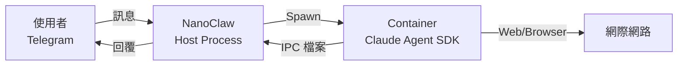
```mermaid
graph LR
    A[使用者<br>Telegram] -->|訊息| B[NanoClaw<br>Host Process]
    B -->|Spawn| C[Container<br>Claude Agent SDK]
    C -->|IPC 檔案| B
    B -->|回覆| A
    C -->|Web/Browser| D[網際網路]
```

---

## 2. 設計哲學

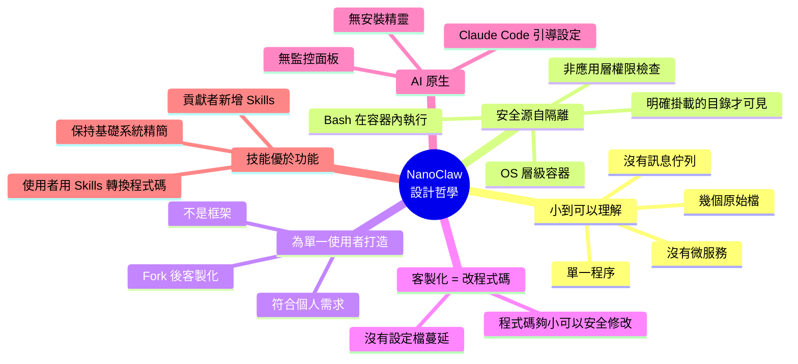
```mermaid
mindmap
  root((NanoClaw<br>設計哲學))
    小到可以理解
      單一程序
      幾個原始檔
      沒有微服務
      沒有訊息佇列
    安全源自隔離
      OS 層級容器
      非應用層權限檢查
      明確掛載的目錄才可見
      Bash 在容器內執行
    為單一使用者打造
      不是框架
      符合個人需求
      Fork 後客製化
    客製化 = 改程式碼
      沒有設定檔蔓延
      程式碼夠小可以安全修改
    AI 原生
      Claude Code 引導設定
      無安裝精靈
      無監控面板
    技能優於功能
      貢獻者新增 Skills
      使用者用 Skills 轉換程式碼
      保持基礎系統精簡
```

| 原則 | 說明 |
|------|------|
| **小到可以理解** | 單一程序，少數原始檔，無微服務、無訊息佇列、無抽象層 |
| **安全源自隔離** | Agent 在 Linux 容器中執行（Apple Container/Docker），只能看到明確掛載的目錄 |
| **為單一使用者打造** | 這不是框架，是為個人需求量身訂做的軟體 |
| **客製化 = 改程式碼** | 不搞設定檔蔓延，程式碼夠小可以直接改 |
| **AI 原生開發** | 用 Claude Code 引導設定、除錯、客製化 |
| **技能優於功能** | 貢獻者提交 Skills（如 `/add-gmail`）而非在基礎系統加功能 |

---

## 3. 整體架構

### 3.1 系統架構圖

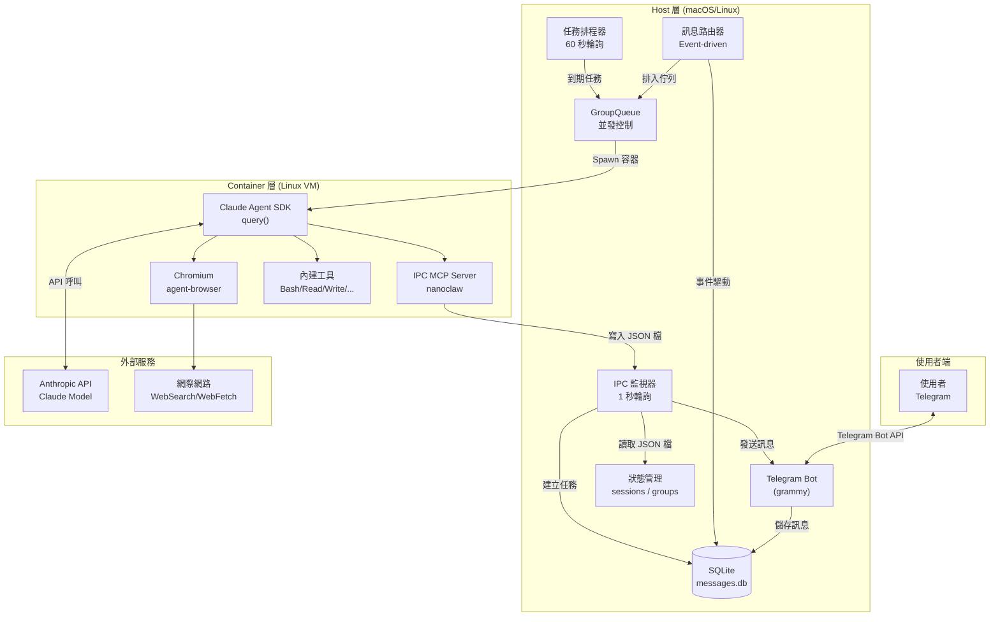
```mermaid
graph TB
    subgraph "使用者端"
        Phone["使用者<br>Telegram"]
    end

    subgraph "Host 層 (macOS/Linux)"
        TG["Telegram Bot<br>(grammy)"]
        Router["訊息路由器<br>Event-driven"]
        Scheduler["任務排程器<br>60 秒輪詢"]
        IPC["IPC 監視器<br>1 秒輪詢"]
        Queue["GroupQueue<br>並發控制"]
        DB[(SQLite<br>messages.db)]
        State["狀態管理<br>sessions / groups"]
    end

    subgraph "Container 層 (Linux VM)"
        Agent["Claude Agent SDK<br>query()"]
        MCP["IPC MCP Server<br>nanoclaw"]
        Browser["Chromium<br>agent-browser"]
        Tools["內建工具<br>Bash/Read/Write/..."]
    end

    subgraph "外部服務"
        Claude["Anthropic API<br>Claude Model"]
        Web["網際網路<br>WebSearch/WebFetch"]
    end

    Phone <-->|Telegram Bot API| TG
    TG -->|儲存訊息| DB
    Router -->|事件驅動| DB
    Router -->|排入佇列| Queue
    Queue -->|Spawn 容器| Agent
    Scheduler -->|到期任務| Queue
    Agent <-->|API 呼叫| Claude
    Agent --> Tools
    Agent --> Browser
    Browser --> Web
    Agent --> MCP
    MCP -->|寫入 JSON 檔| IPC
    IPC -->|讀取 JSON 檔| State
    IPC -->|建立任務| DB
    IPC -->|發送訊息| TG
```

### 3.2 分層架構

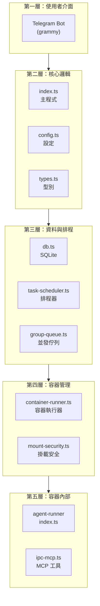
```mermaid
graph TB
    subgraph L1["第一層：使用者介面"]
        Telegram["Telegram Bot<br>(grammy)"]
    end

    subgraph L2["第二層：核心邏輯"]
        Index["index.ts<br>主程式"]
        Config["config.ts<br>設定"]
        Types["types.ts<br>型別"]
    end

    subgraph L3["第三層：資料與排程"]
        DB2["db.ts<br>SQLite"]
        TaskSched["task-scheduler.ts<br>排程器"]
        GQueue["group-queue.ts<br>並發佇列"]
    end

    subgraph L4["第四層：容器管理"]
        CRunner["container-runner.ts<br>容器執行器"]
        MSec["mount-security.ts<br>掛載安全"]
    end

    subgraph L5["第五層：容器內部"]
        ARunner["agent-runner<br>index.ts"]
        IPCMCP["ipc-mcp.ts<br>MCP 工具"]
    end

    L1 --> L2
    L2 --> L3
    L3 --> L4
    L4 --> L5
```

---

## 4. 目錄結構

```
nanoclaw/
├── src/                          # 主機端原始碼
│   ├── index.ts                  # 主程式 (935 行)
│   ├── config.ts                 # 設定常數 (52 行)
│   ├── types.ts                  # TypeScript 介面 (76 行)
│   ├── db.ts                     # SQLite 資料庫層 (590 行)
│   ├── container-runner.ts       # 容器生成與管理 (527 行)
│   ├── task-scheduler.ts         # 排程任務執行 (193 行)
│   ├── group-queue.ts            # 並發容器限制 (301 行)
│   ├── mount-security.ts         # 掛載白名單驗證 (414 行)
│   ├── telegram-auth.ts          # Telegram Bot Token 驗證 (約 35 行)
│   └── logger.ts                 # Pino 日誌 (7 行)
│
├── container/                    # 容器相關
│   ├── Dockerfile                # 容器映像定義
│   ├── build.sh                  # 建構腳本
│   └── agent-runner/             # 容器內執行的程式碼
│       ├── package.json
│       ├── tsconfig.json
│       └── src/
│           ├── index.ts          # Agent 進入點
│           └── ipc-mcp.ts        # IPC MCP Server
│
├── groups/                       # 群組資料（每群組一個資料夾）
│   ├── CLAUDE.md                 # 全域記憶
│   ├── main/                     # 主頻道（自聊）
│   │   ├── CLAUDE.md
│   │   └── logs/
│   └── global/
│       └── CLAUDE.md             # 全域共享記憶
│
├── store/                        # 本地儲存（git 忽略）
│   ├── auth/                     # （已棄用）
│   └── messages.db               # SQLite 資料庫
│
├── data/                         # 應用程式狀態（git 忽略）
│   ├── env/                      # 過濾後的環境變數
│   ├── sessions/                 # 每群組 Claude Session
│   │   └── {group}/.claude/
│   └── ipc/                      # 每群組 IPC 命名空間
│       └── {group}/
│           ├── messages/
│           ├── tasks/
│           ├── current_tasks.json
│           └── available_groups.json
│
├── docs/                         # 技術文件
│   ├── REQUIREMENTS.md           # 架構決策
│   └── SECURITY.md               # 安全模型
│
├── launchd/                      # macOS 服務設定
│   └── com.nanoclaw.plist
│
├── config-examples/              # 設定範例
│   └── mount-allowlist.json
│
├── .claude/skills/               # Claude Code Skills
│   ├── setup/
│   ├── customize/
│   ├── debug/
│   ├── add-gmail/
│   ├── add-voice-transcription/
│   └── x-integration/
│
├── package.json
├── tsconfig.json
├── CLAUDE.md                     # Claude Code 專案指示
└── README.md
```

---

## 5. 核心元件詳解

### 5.1 主程式 index.ts

**檔案路徑**：`src/index.ts`（935 行）

這是整個系統的心臟，負責所有核心邏輯的協調。

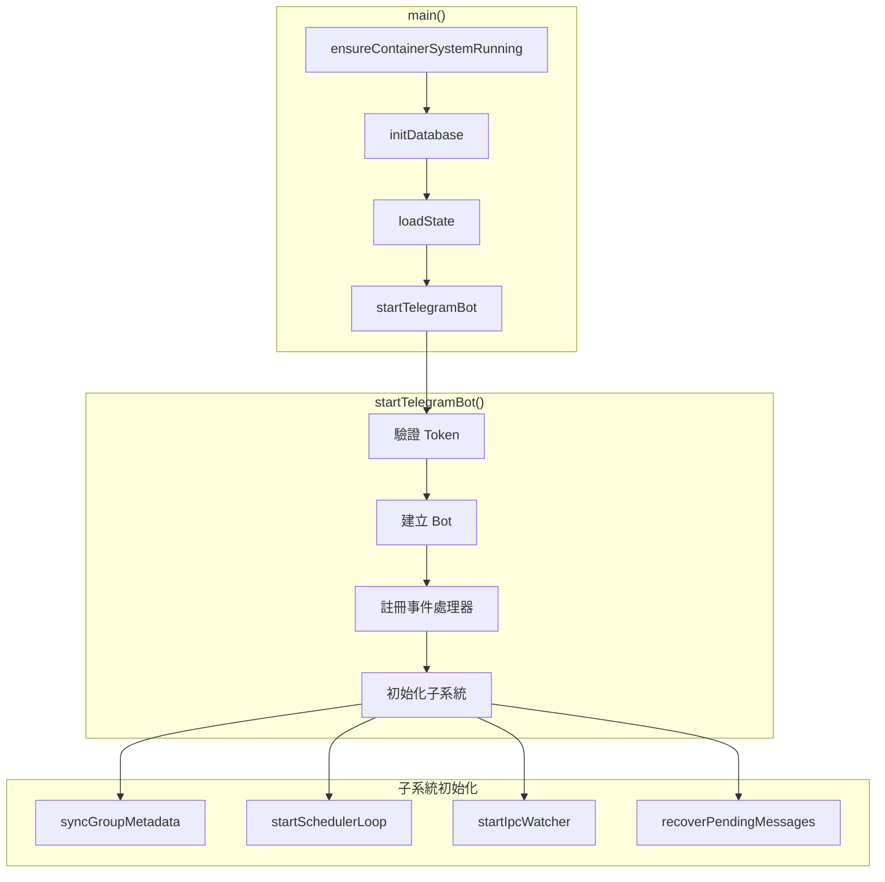
```mermaid
graph TB
    subgraph "main()"
        A[ensureContainerSystemRunning] --> B[initDatabase]
        B --> C[loadState]
        C --> D[startTelegramBot]
    end

    subgraph "startTelegramBot()"
        D --> E[驗證 Token]
        E --> F[建立 Bot]
        F --> G[註冊事件處理器]
        G --> H[初始化子系統]
    end

    subgraph "子系統初始化"
        H --> K[syncGroupMetadata]
        H --> L[startSchedulerLoop]
        H --> M[startIpcWatcher]
        H --> N[recoverPendingMessages]
    end
```

#### 主要函式說明

| 函式 | 說明 |
|------|------|
| `main()` | 進入點：啟動容器系統、初始化 DB、載入狀態、啟動 Telegram Bot |
| `startTelegramBot()` | 使用 grammy 建立 Telegram Bot，註冊事件處理器，啟動 Long Polling |
| `processGroupMessages()` | 處理單一群組的待處理訊息，建構 XML 格式的 prompt |
| `runAgent()` | 生成容器、執行 Claude Agent SDK、處理回應 |
| `startIpcWatcher()` | 每 1 秒掃描 IPC 目錄，處理訊息發送和任務操作 |
| `processTaskIpc()` | 處理 IPC 任務請求（建立/暫停/恢復/取消任務、註冊群組） |
| `syncGroupMetadata()` | 從 Telegram 同步群組名稱（24 小時快取） |
| `recoverPendingMessages()` | 啟動恢復：檢查崩潰期間未處理的訊息 |
| `sendMessage()` | 透過 Telegram Bot API 發送訊息 |

#### 關鍵狀態變數

```typescript
let bot: Bot;                                // grammy Bot 實例
let botUsername: string;                     // Bot 的 username
let sessions: Record<string, string> = {};   // 群組 → Session ID
let registeredGroups: Record<string, RegisteredGroup> = {};  // JID → 群組設定
let lastAgentTimestamp: Record<string, string> = {};  // 群組 → 最後 Agent 處理時間
```

#### 訊息格式轉換

收到的 Telegram 訊息會被轉換為 XML 格式傳給 Claude：

```xml
<messages>
  <message sender="John" time="2026-01-31T14:32:00Z">嘿大家，今晚吃披薩怎麼樣？</message>
  <message sender="Sarah" time="2026-01-31T14:33:00Z">聽起來不錯</message>
  <message sender="John" time="2026-01-31T14:35:00Z">@Andy 你推薦什麼配料？</message>
</messages>
```

#### 機器人訊息過濾

NanoClaw 使用**訊息前綴**判斷是否為機器人自己的回覆：

```sql
-- 過濾掉以 "Andy:" 開頭的訊息（機器人回覆）
WHERE content NOT LIKE 'Andy:%'
```

---

### 5.2 設定檔 config.ts

**檔案路徑**：`src/config.ts`（52 行）

集中管理所有設定常數，支援環境變數覆蓋。

| 常數 | 預設值 | 說明 |
|------|--------|------|
| `ASSISTANT_NAME` | `'Andy'` | 助理名稱，影響觸發詞和回覆前綴 |
| `SCHEDULER_POLL_INTERVAL` | `60000` ms | 排程器輪詢間隔 |
| `TELEGRAM_MAX_MESSAGE_LENGTH` | `4096` | Telegram 訊息長度上限 |
| `IPC_POLL_INTERVAL` | `1000` ms | IPC 目錄掃描間隔 |
| `TRIGGER_PATTERN` | `/^@Andy\b/i` | 觸發正則表達式 |
| `CONTAINER_IMAGE` | `'nanoclaw-agent:latest'` | 容器映像名稱 |
| `CONTAINER_TIMEOUT` | `300000` ms (5 分鐘) | 容器執行超時 |
| `CONTAINER_MAX_OUTPUT_SIZE` | `10485760` (10MB) | 容器輸出大小上限 |
| `MAX_CONCURRENT_CONTAINERS` | `5` | 最大同時執行容器數 |
| `MOUNT_ALLOWLIST_PATH` | `~/.config/nanoclaw/mount-allowlist.json` | 掛載白名單路徑 |
| `TIMEZONE` | 系統時區 | 排程任務使用的時區 |

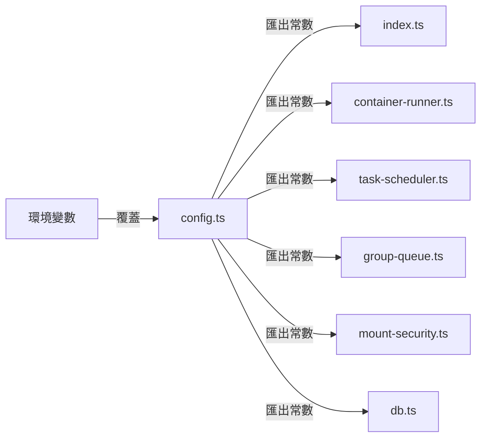
```mermaid
graph LR
    ENV["環境變數"] -->|覆蓋| Config["config.ts"]
    Config -->|匯出常數| Index["index.ts"]
    Config -->|匯出常數| CR["container-runner.ts"]
    Config -->|匯出常數| TS["task-scheduler.ts"]
    Config -->|匯出常數| GQ["group-queue.ts"]
    Config -->|匯出常數| MS["mount-security.ts"]
    Config -->|匯出常數| DB["db.ts"]
```

---

### 5.3 型別定義 types.ts

**檔案路徑**：`src/types.ts`（76 行）

定義所有核心資料結構：

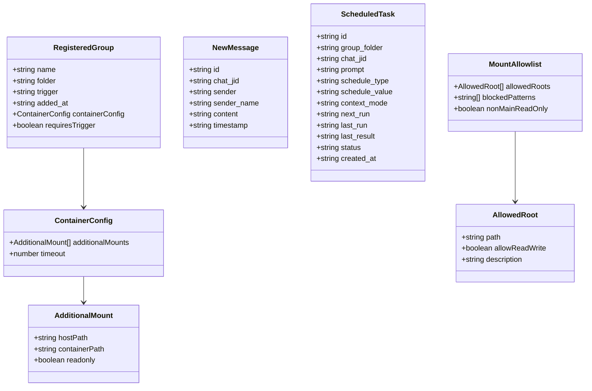
```mermaid
classDiagram
    class RegisteredGroup {
        +string name
        +string folder
        +string trigger
        +string added_at
        +ContainerConfig containerConfig
        +boolean requiresTrigger
    }

    class ContainerConfig {
        +AdditionalMount[] additionalMounts
        +number timeout
    }

    class AdditionalMount {
        +string hostPath
        +string containerPath
        +boolean readonly
    }

    class NewMessage {
        +string id
        +string chat_jid
        +string sender
        +string sender_name
        +string content
        +string timestamp
    }

    class ScheduledTask {
        +string id
        +string group_folder
        +string chat_jid
        +string prompt
        +string schedule_type
        +string schedule_value
        +string context_mode
        +string next_run
        +string last_run
        +string last_result
        +string status
        +string created_at
    }

    class MountAllowlist {
        +AllowedRoot[] allowedRoots
        +string[] blockedPatterns
        +boolean nonMainReadOnly
    }

    class AllowedRoot {
        +string path
        +boolean allowReadWrite
        +string description
    }

    RegisteredGroup --> ContainerConfig
    ContainerConfig --> AdditionalMount
    MountAllowlist --> AllowedRoot
```

---

### 5.4 資料庫層 db.ts

**檔案路徑**：`src/db.ts`（590 行）

使用 `better-sqlite3` 管理所有持久化資料。

#### 資料表結構

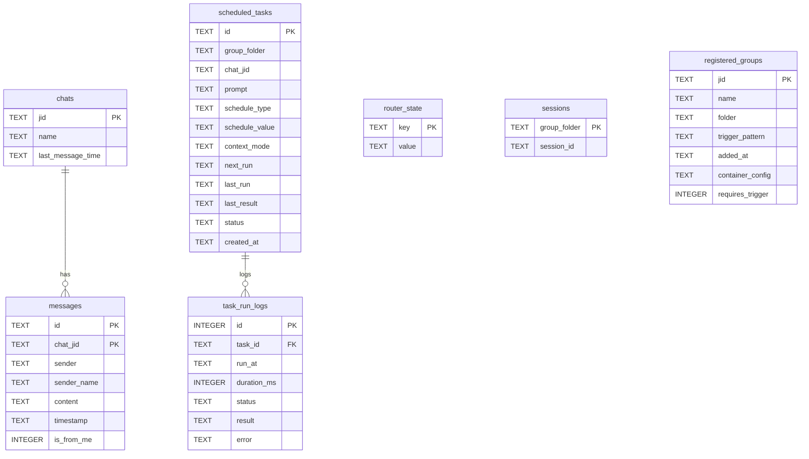
```mermaid
erDiagram
    chats {
        TEXT jid PK
        TEXT name
        TEXT last_message_time
    }

    messages {
        TEXT id PK
        TEXT chat_jid PK
        TEXT sender
        TEXT sender_name
        TEXT content
        TEXT timestamp
        INTEGER is_from_me
    }

    scheduled_tasks {
        TEXT id PK
        TEXT group_folder
        TEXT chat_jid
        TEXT prompt
        TEXT schedule_type
        TEXT schedule_value
        TEXT context_mode
        TEXT next_run
        TEXT last_run
        TEXT last_result
        TEXT status
        TEXT created_at
    }

    task_run_logs {
        INTEGER id PK
        TEXT task_id FK
        TEXT run_at
        INTEGER duration_ms
        TEXT status
        TEXT result
        TEXT error
    }

    router_state {
        TEXT key PK
        TEXT value
    }

    sessions {
        TEXT group_folder PK
        TEXT session_id
    }

    registered_groups {
        TEXT jid PK
        TEXT name
        TEXT folder
        TEXT trigger_pattern
        TEXT added_at
        TEXT container_config
        INTEGER requires_trigger
    }

    chats ||--o{ messages : "has"
    scheduled_tasks ||--o{ task_run_logs : "logs"
```

#### 主要函式

| 函式 | 說明 |
|------|------|
| `initDatabase()` | 建表、執行遷移（含 JSON → SQLite 自動遷移） |
| `storeMessage()` | 儲存完整訊息內容（僅已註冊群組） |
| `storeChatMetadata()` | 儲存聊天元資料（所有聊天，用於群組發現） |
| `getNewMessages()` | 取得指定時間戳之後的新訊息，過濾機器人自己的訊息 |
| `getMessagesSince()` | 取得特定群組自指定時間後的訊息 |
| `createTask()` / `getDueTasks()` | 排程任務 CRUD |
| `updateTaskAfterRun()` | 執行後更新下次執行時間 |
| `logTaskRun()` | 記錄任務執行結果 |
| `migrateJsonState()` | 從 JSON 檔案自動遷移到 SQLite |

#### JSON → SQLite 自動遷移

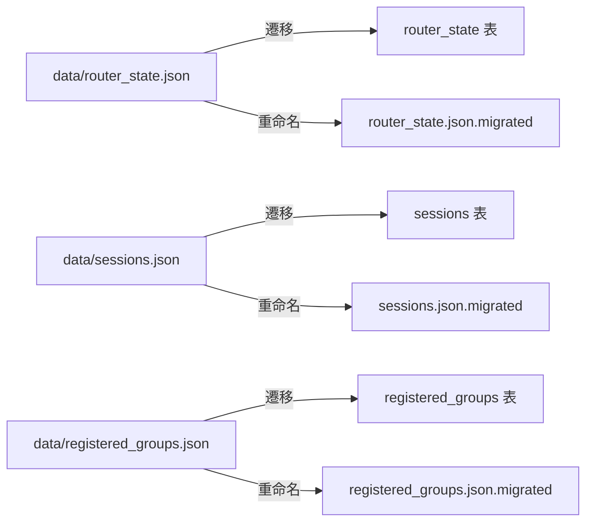
```mermaid
graph LR
    A["data/router_state.json"] -->|遷移| B["router_state 表"]
    C["data/sessions.json"] -->|遷移| D["sessions 表"]
    E["data/registered_groups.json"] -->|遷移| F["registered_groups 表"]
    A -->|重命名| G["router_state.json.migrated"]
    C -->|重命名| H["sessions.json.migrated"]
    E -->|重命名| I["registered_groups.json.migrated"]
```

---

### 5.5 容器執行器 container-runner.ts

**檔案路徑**：`src/container-runner.ts`（527 行）

負責生成和管理 Agent 容器的核心模組。

#### 容器掛載策略

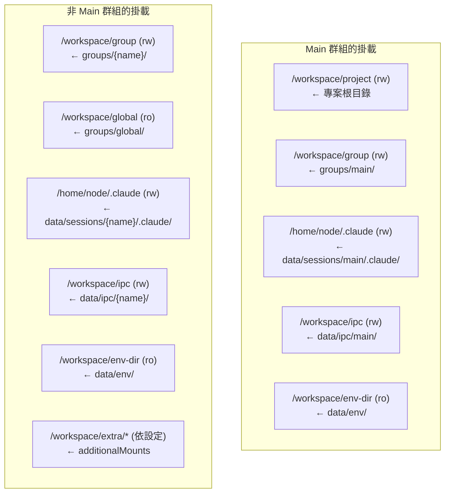
```mermaid
graph TB
    subgraph "Main 群組的掛載"
        M1["/workspace/project (rw)<br>← 專案根目錄"]
        M2["/workspace/group (rw)<br>← groups/main/"]
        M3["/home/node/.claude (rw)<br>← data/sessions/main/.claude/"]
        M4["/workspace/ipc (rw)<br>← data/ipc/main/"]
        M5["/workspace/env-dir (ro)<br>← data/env/"]
    end

    subgraph "非 Main 群組的掛載"
        N1["/workspace/group (rw)<br>← groups/{name}/"]
        N2["/workspace/global (ro)<br>← groups/global/"]
        N3["/home/node/.claude (rw)<br>← data/sessions/{name}/.claude/"]
        N4["/workspace/ipc (rw)<br>← data/ipc/{name}/"]
        N5["/workspace/env-dir (ro)<br>← data/env/"]
        N6["/workspace/extra/* (依設定)<br>← additionalMounts"]
    end
```

#### 容器執行流程

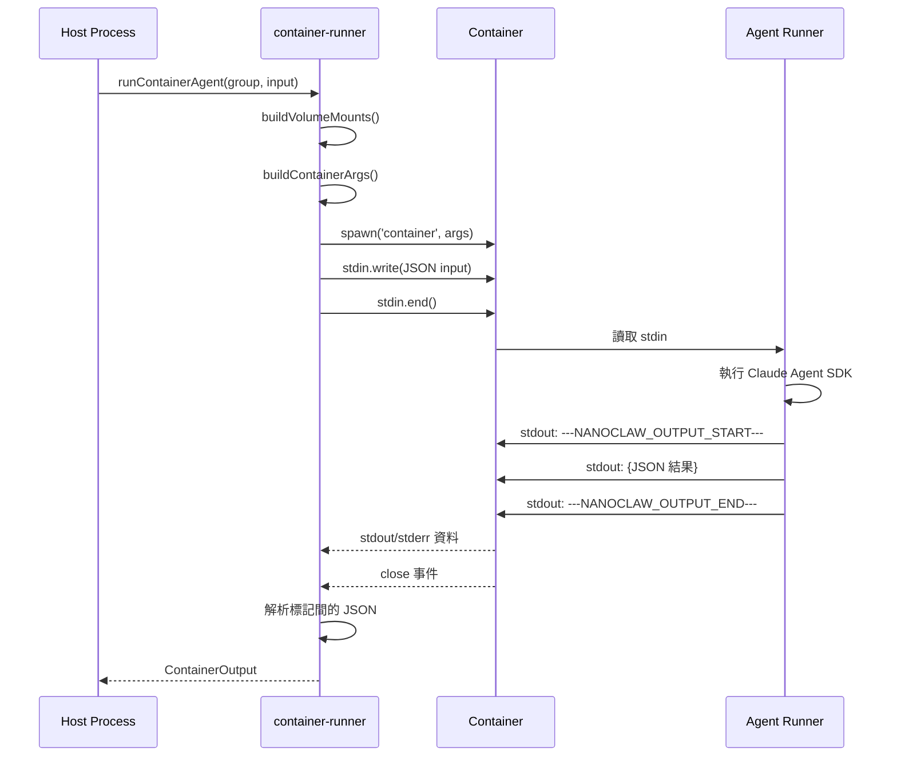
```mermaid
sequenceDiagram
    participant Host as Host Process
    participant CR as container-runner
    participant C as Container
    participant Agent as Agent Runner

    Host->>CR: runContainerAgent(group, input)
    CR->>CR: buildVolumeMounts()
    CR->>CR: buildContainerArgs()
    CR->>C: spawn('container', args)
    CR->>C: stdin.write(JSON input)
    CR->>C: stdin.end()

    C->>Agent: 讀取 stdin
    Agent->>Agent: 執行 Claude Agent SDK
    Agent->>C: stdout: ---NANOCLAW_OUTPUT_START---
    Agent->>C: stdout: {JSON 結果}
    Agent->>C: stdout: ---NANOCLAW_OUTPUT_END---

    C-->>CR: stdout/stderr 資料
    C-->>CR: close 事件
    CR->>CR: 解析標記間的 JSON
    CR-->>Host: ContainerOutput
```

#### 輸出解析

容器使用哨兵標記（Sentinel Markers）確保 JSON 輸出的穩健解析：

```
[... 各種 stderr/stdout 雜訊 ...]
---NANOCLAW_OUTPUT_START---
{"status":"success","result":{"outputType":"message","userMessage":"你好！"},"newSessionId":"abc123"}
---NANOCLAW_OUTPUT_END---
```

#### Apple Container 的特殊處理

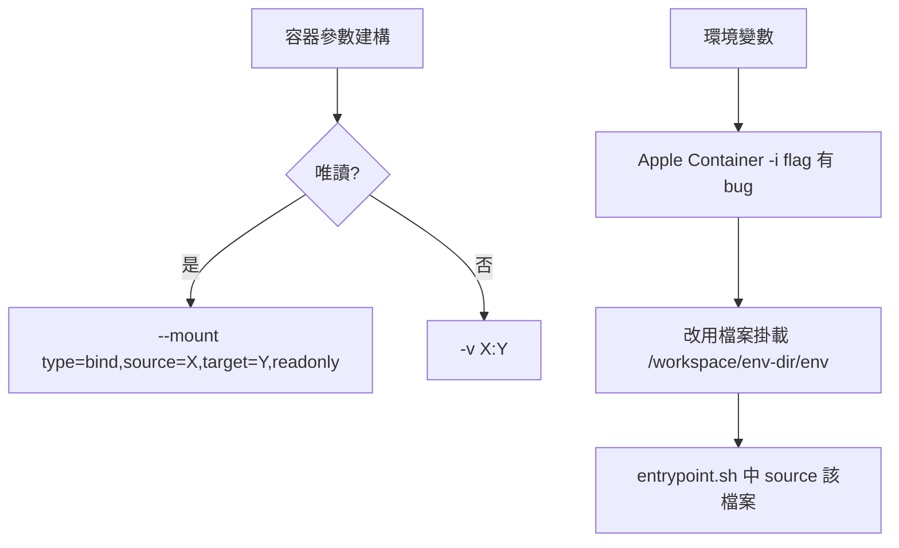
```mermaid
graph TD
    A["容器參數建構"] --> B{唯讀?}
    B -->|是| C["--mount type=bind,source=X,target=Y,readonly"]
    B -->|否| D["-v X:Y"]

    E["環境變數"] --> F["Apple Container -i flag 有 bug"]
    F --> G["改用檔案掛載 /workspace/env-dir/env"]
    G --> H["entrypoint.sh 中 source 該檔案"]
```

---

### 5.6 任務排程器 task-scheduler.ts

**檔案路徑**：`src/task-scheduler.ts`（193 行）

#### 排程器運作流程

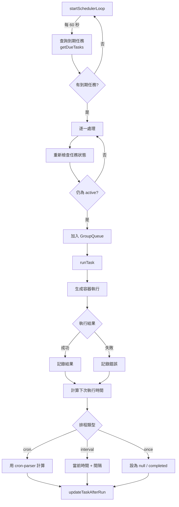
```mermaid
graph TB
    A[startSchedulerLoop] -->|每 60 秒| B[查詢到期任務<br>getDueTasks]
    B --> C{有到期任務?}
    C -->|否| A
    C -->|是| D[逐一處理]
    D --> E[重新檢查任務狀態]
    E --> F{仍為 active?}
    F -->|否| D
    F -->|是| G[加入 GroupQueue]
    G --> H[runTask]
    H --> I[生成容器執行]
    I --> J{執行結果}
    J -->|成功| K[記錄結果]
    J -->|失敗| L[記錄錯誤]
    K --> M[計算下次執行時間]
    L --> M
    M --> N{排程類型}
    N -->|cron| O[用 cron-parser 計算]
    N -->|interval| P[當前時間 + 間隔]
    N -->|once| Q[設為 null / completed]
    O --> R[updateTaskAfterRun]
    P --> R
    Q --> R
```

#### 排程類型

| 類型 | 格式範例 | 說明 |
|------|----------|------|
| `cron` | `"0 9 * * *"` | 每天早上 9 點（本地時區） |
| `interval` | `"3600000"` | 每小時（毫秒） |
| `once` | `"2026-02-01T15:30:00"` | 一次性，指定本地時間 |

#### 上下文模式

| 模式 | 說明 | 適用場景 |
|------|------|----------|
| `group` | 使用群組當前 Session | 需要對話歷史的任務 |
| `isolated` | 全新 Session | 獨立任務，所有上下文在 prompt 中 |

---

### 5.7 群組佇列 group-queue.ts

**檔案路徑**：`src/group-queue.ts`（301 行）

管理容器並發執行的核心元件，防止資源耗盡。

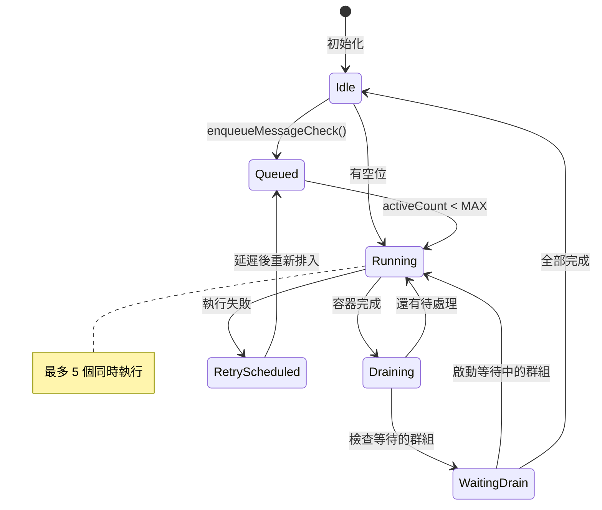
```mermaid
stateDiagram-v2
    [*] --> Idle: 初始化

    Idle --> Queued: enqueueMessageCheck()
    Idle --> Running: 有空位

    Queued --> Running: activeCount < MAX
    Running --> Draining: 容器完成
    Draining --> Running: 還有待處理
    Draining --> WaitingDrain: 檢查等待的群組
    WaitingDrain --> Running: 啟動等待中的群組
    WaitingDrain --> Idle: 全部完成

    Running --> RetryScheduled: 執行失敗
    RetryScheduled --> Queued: 延遲後重新排入

    note right of Running : 最多 5 個同時執行
```

#### 關鍵設定

| 參數 | 值 | 說明 |
|------|-----|------|
| `MAX_CONCURRENT_CONTAINERS` | 5 | 最大同時容器數 |
| `MAX_RETRIES` | 5 | 最大重試次數 |
| `BASE_RETRY_MS` | 5000 | 基礎重試延遲 |

#### 重試機制

使用**指數退避**（Exponential Backoff）：

```
第 1 次重試: 5,000 ms
第 2 次重試: 10,000 ms
第 3 次重試: 20,000 ms
第 4 次重試: 40,000 ms
第 5 次重試: 80,000 ms
超過 5 次: 放棄，等下一條新訊息觸發
```

#### 排入優先順序

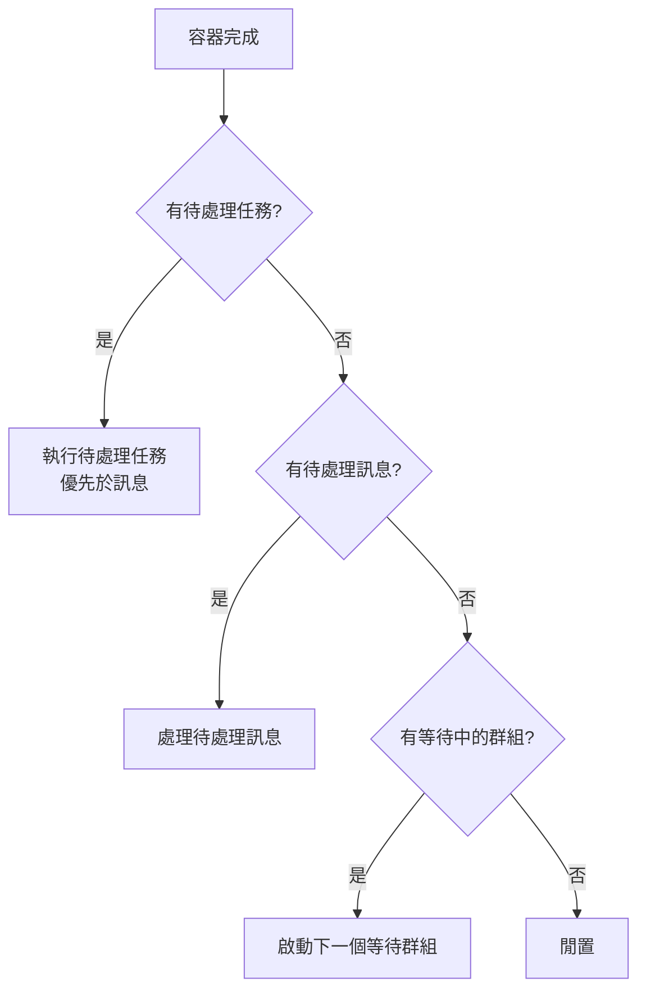
```mermaid
graph TD
    A[容器完成] --> B{有待處理任務?}
    B -->|是| C[執行待處理任務<br>優先於訊息]
    B -->|否| D{有待處理訊息?}
    D -->|是| E[處理待處理訊息]
    D -->|否| F{有等待中的群組?}
    F -->|是| G[啟動下一個等待群組]
    F -->|否| H[閒置]
```

#### 優雅關閉

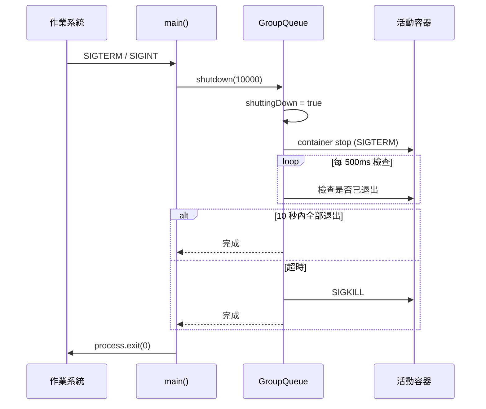
```mermaid
sequenceDiagram
    participant OS as 作業系統
    participant Main as main()
    participant Queue as GroupQueue
    participant Containers as 活動容器

    OS->>Main: SIGTERM / SIGINT
    Main->>Queue: shutdown(10000)
    Queue->>Queue: shuttingDown = true
    Queue->>Containers: container stop (SIGTERM)

    loop 每 500ms 檢查
        Queue->>Containers: 檢查是否已退出
    end

    alt 10 秒內全部退出
        Queue-->>Main: 完成
    else 超時
        Queue->>Containers: SIGKILL
        Queue-->>Main: 完成
    end

    Main->>OS: process.exit(0)
```

---

### 5.8 掛載安全模組 mount-security.ts

**檔案路徑**：`src/mount-security.ts`（414 行）

驗證額外掛載是否符合外部白名單的安全規則。

#### 驗證流程

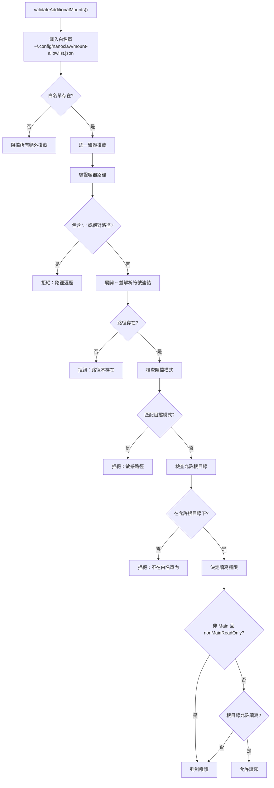
```mermaid
graph TB
    A["validateAdditionalMounts()"] --> B["載入白名單<br>~/.config/nanoclaw/mount-allowlist.json"]
    B --> C{白名單存在?}
    C -->|否| D["阻擋所有額外掛載"]
    C -->|是| E["逐一驗證掛載"]

    E --> F["驗證容器路徑"]
    F --> G{包含 '..' 或絕對路徑?}
    G -->|是| H["拒絕：路徑遍歷"]
    G -->|否| I["展開 ~ 並解析符號連結"]

    I --> J{路徑存在?}
    J -->|否| K["拒絕：路徑不存在"]
    J -->|是| L["檢查阻擋模式"]

    L --> M{匹配阻擋模式?}
    M -->|是| N["拒絕：敏感路徑"]
    M -->|否| O["檢查允許根目錄"]

    O --> P{在允許根目錄下?}
    P -->|否| Q["拒絕：不在白名單內"]
    P -->|是| R["決定讀寫權限"]

    R --> S{非 Main 且 nonMainReadOnly?}
    S -->|是| T["強制唯讀"]
    S -->|否| U{根目錄允許讀寫?}
    U -->|是| V["允許讀寫"]
    U -->|否| T
```

#### 預設阻擋模式

以下路徑模式**永遠**被阻擋，即使在白名單中：

```
.ssh, .gnupg, .gpg, .aws, .azure, .gcloud, .kube, .docker,
credentials, .env, .netrc, .npmrc, .pypirc,
id_rsa, id_ed25519, private_key, .secret
```

#### 白名單範例

```json
{
  "allowedRoots": [
    {
      "path": "~/projects",
      "allowReadWrite": true,
      "description": "開發專案"
    },
    {
      "path": "~/Documents/work",
      "allowReadWrite": false,
      "description": "工作文件（唯讀）"
    }
  ],
  "blockedPatterns": ["password", "secret", "token"],
  "nonMainReadOnly": true
}
```

---

### 5.9 Telegram 認證 telegram-auth.ts

**檔案路徑**：`src/telegram-auth.ts`（約 35 行）

獨立的 Telegram Bot Token 驗證腳本。

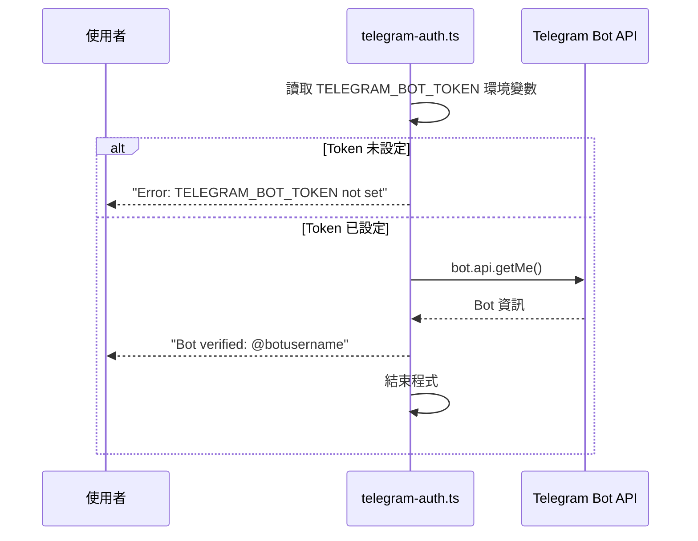
```mermaid
sequenceDiagram
    participant User as 使用者
    participant Script as telegram-auth.ts
    participant API as Telegram Bot API

    Script->>Script: 讀取 TELEGRAM_BOT_TOKEN 環境變數
    alt Token 未設定
        Script-->>User: "Error: TELEGRAM_BOT_TOKEN not set"
    else Token 已設定
        Script->>API: bot.api.getMe()
        API-->>Script: Bot 資訊
        Script-->>User: "Bot verified: @botusername"
        Script->>Script: 結束程式
    end
```

---

### 5.10 日誌模組 logger.ts

**檔案路徑**：`src/logger.ts`（7 行）

使用 Pino JSON 結構化日誌，配合 pino-pretty 美化輸出：

```typescript
import pino from 'pino';

export const logger = pino({
  level: process.env.LOG_LEVEL || 'info',
  transport: { target: 'pino-pretty', options: { colorize: true } },
});
```

可透過 `LOG_LEVEL=debug` 環境變數啟用詳細日誌。

---

## 6. Container 機制

### 6.1 Dockerfile

**檔案路徑**：`container/Dockerfile`

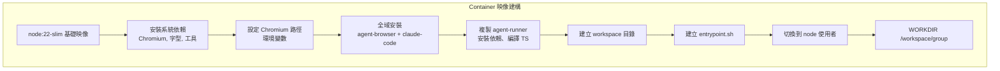
```mermaid
graph TB
    subgraph "Container 映像建構"
        A["node:22-slim 基礎映像"] --> B["安裝系統依賴<br>Chromium, 字型, 工具"]
        B --> C["設定 Chromium 路徑<br>環境變數"]
        C --> D["全域安裝<br>agent-browser + claude-code"]
        D --> E["複製 agent-runner<br>安裝依賴、編譯 TS"]
        E --> F["建立 workspace 目錄"]
        F --> G["建立 entrypoint.sh"]
        G --> H["切換到 node 使用者"]
        H --> I["WORKDIR /workspace/group"]
    end
```

#### 容器內的目錄結構

```
/
├── app/                         # Agent Runner 程式碼
│   ├── dist/index.js           # 編譯後的進入點
│   └── entrypoint.sh           # 進入點腳本
├── workspace/
│   ├── project/                # 專案根目錄（僅 main）
│   ├── group/                  # 群組資料夾（工作目錄）
│   ├── global/                 # 全域記憶（唯讀，非 main）
│   ├── extra/                  # 額外掛載
│   ├── ipc/                    # IPC 通訊
│   │   ├── messages/
│   │   ├── tasks/
│   │   ├── current_tasks.json
│   │   └── available_groups.json
│   └── env-dir/
│       └── env                 # 認證環境變數（唯讀）
├── home/node/.claude/           # Claude Session 資料
└── usr/bin/chromium              # Chromium 瀏覽器
```

#### entrypoint.sh 的作用

```bash
#!/bin/bash
set -e
# 載入認證環境變數（解決 Apple Container -i flag 的 bug）
[ -f /workspace/env-dir/env ] && export $(cat /workspace/env-dir/env | xargs)
# 從 stdin 讀取 JSON 輸入並存為臨時檔
cat > /tmp/input.json
# 執行 Agent Runner
node /app/dist/index.js < /tmp/input.json
```

---

### 6.2 Agent Runner

**檔案路徑**：`container/agent-runner/src/index.ts`（344 行）

容器內執行的核心程式碼，負責呼叫 Claude Agent SDK。

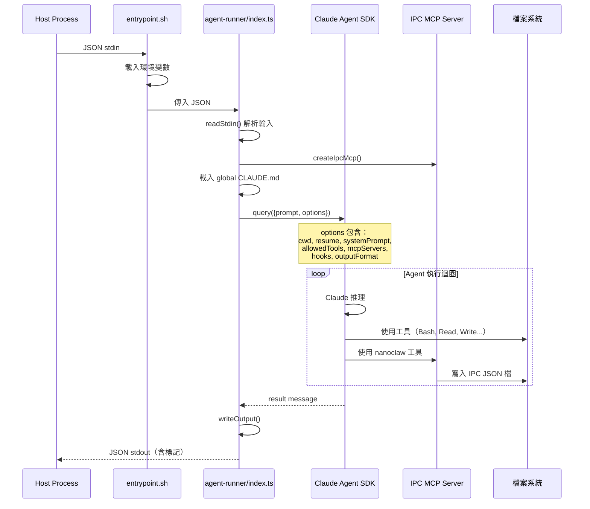
```mermaid
sequenceDiagram
    participant Host as Host Process
    participant Entry as entrypoint.sh
    participant Runner as agent-runner/index.ts
    participant SDK as Claude Agent SDK
    participant MCP as IPC MCP Server
    participant Files as 檔案系統

    Host->>Entry: JSON stdin
    Entry->>Entry: 載入環境變數
    Entry->>Runner: 傳入 JSON

    Runner->>Runner: readStdin() 解析輸入
    Runner->>MCP: createIpcMcp()
    Runner->>Runner: 載入 global CLAUDE.md

    Runner->>SDK: query({prompt, options})
    Note over SDK: options 包含：<br>cwd, resume, systemPrompt,<br>allowedTools, mcpServers,<br>hooks, outputFormat

    loop Agent 執行迴圈
        SDK->>SDK: Claude 推理
        SDK->>Files: 使用工具（Bash, Read, Write...）
        SDK->>MCP: 使用 nanoclaw 工具
        MCP->>Files: 寫入 IPC JSON 檔
    end

    SDK-->>Runner: result message
    Runner->>Runner: writeOutput()
    Runner-->>Host: JSON stdout（含標記）
```

#### Agent 可用工具

| 工具 | 說明 |
|------|------|
| `Bash` | 在容器內執行 Shell 命令 |
| `Read` / `Write` / `Edit` | 檔案操作 |
| `Glob` / `Grep` | 檔案搜尋 |
| `WebSearch` / `WebFetch` | 網路搜尋和抓取 |
| `mcp__nanoclaw__*` | IPC 工具（發送訊息、排程任務等） |

#### 輸入/輸出格式

**輸入（ContainerInput）**：

```typescript
{
  prompt: string;        // 訊息或任務 prompt
  sessionId?: string;    // 恢復 Session
  groupFolder: string;   // 群組資料夾名稱
  chatJid: string;       // Telegram 聊天 ID
  isMain: boolean;       // 是否為主頻道
  isScheduledTask?: boolean;  // 是否為排程任務
}
```

**輸出（ContainerOutput）**：

```typescript
{
  status: 'success' | 'error';
  result: {
    outputType: 'message' | 'log';
    userMessage?: string;    // 傳送給使用者的訊息
    internalLog?: string;    // 僅內部記錄
  } | null;
  newSessionId?: string;
  error?: string;
}
```

#### Pre-Compact Hook — 對話歸檔

當 Claude Agent SDK 壓縮 Session 之前，會將完整對話記錄歸檔：

```mermaid
graph LR
    A[Session 過長] -->|觸發壓縮| B[PreCompact Hook]
    B --> C[讀取完整 transcript]
    C --> D[解析為 Markdown 格式]
    D --> E[儲存到<br>/workspace/group/conversations/<br>2026-02-01-topic.md]
    E --> F[壓縮 Session]
```

---

### 6.3 IPC MCP Server

**檔案路徑**：`container/agent-runner/src/ipc-mcp.ts`（321 行）

在容器內建立 MCP（Model Context Protocol）Server，讓 Claude Agent 能透過 IPC 與 Host 通訊。

#### 可用工具

```mermaid
graph TB
    subgraph "IPC MCP 工具"
        SM["send_message<br>發送訊息"]
        ST["schedule_task<br>排程任務"]
        LT["list_tasks<br>列出任務"]
        PT["pause_task<br>暫停任務"]
        RT["resume_task<br>恢復任務"]
        CT["cancel_task<br>取消任務"]
        RG["register_group<br>註冊群組<br>(僅 main)"]
    end

    subgraph "IPC 檔案系統"
        MD["/workspace/ipc/messages/"]
        TD["/workspace/ipc/tasks/"]
        TF["/workspace/ipc/current_tasks.json"]
    end

    SM -->|寫入 JSON| MD
    ST -->|寫入 JSON| TD
    LT -->|讀取| TF
    PT -->|寫入 JSON| TD
    RT -->|寫入 JSON| TD
    CT -->|寫入 JSON| TD
    RG -->|寫入 JSON| TD
```

#### IPC 檔案寫入機制

使用**原子寫入**（Atomic Write）防止資料損壞：

```typescript
function writeIpcFile(dir: string, data: object): string {
  const filename = `${Date.now()}-${random}.json`;
  const filepath = path.join(dir, filename);
  const tempPath = `${filepath}.tmp`;

  // 先寫入臨時檔，再重命名（原子操作）
  fs.writeFileSync(tempPath, JSON.stringify(data, null, 2));
  fs.renameSync(tempPath, filepath);

  return filename;
}
```

#### 權限控制

| 工具 | Main 群組 | 非 Main 群組 |
|------|-----------|-------------|
| `send_message` | 可發送到任何聊天 | 只能發送到自己的聊天 |
| `schedule_task` | 可為任何群組排程 | 只能為自己排程 |
| `list_tasks` | 看到所有任務 | 只看到自己的任務 |
| `pause/resume/cancel_task` | 可管理任何任務 | 只能管理自己的任務 |
| `register_group` | 可以 | 不可以 |

---

### 6.4 Container 建構流程

**檔案路徑**：`container/build.sh`

```mermaid
graph LR
    A["執行 ./container/build.sh"] --> B["cd container/"]
    B --> C["container build -t nanoclaw-agent:latest ."]
    C --> D["Dockerfile 建構"]
    D --> E["映像 nanoclaw-agent:latest"]
```

測試指令：
```bash
echo '{"prompt":"What is 2+2?","groupFolder":"test","chatJid":"test@g.us","isMain":false}' | container run -i nanoclaw-agent:latest
```

---

## 7. 訊息流程

### 7.1 完整訊息處理流程

```mermaid
sequenceDiagram
    participant User as 使用者
    participant TG as Telegram Bot API
    participant Grammy as grammy SDK
    participant DB as SQLite
    participant Queue as GroupQueue
    participant CR as container-runner
    participant Container as Container
    participant Agent as Claude Agent SDK
    participant IPC as IPC Watcher

    User->>TG: "@Andy 明天天氣如何？"
    TG->>Grammy: bot.on('message:text') 事件
    Grammy->>DB: storeChatMetadata()
    Grammy->>DB: storeMessage()
    Grammy->>Queue: enqueueMessageCheck(chatId)

    Queue->>Queue: 檢查並發限制
    Queue->>CR: processGroupMessages(chatId)

    CR->>DB: getMessagesSince()
    CR->>CR: 檢查觸發詞 @Andy / @botusername
    CR->>CR: 建構 XML 格式 prompt
    CR->>CR: startTypingLoop（持續發送 typing 狀態）

    CR->>CR: writeTasksSnapshot()
    CR->>CR: writeGroupsSnapshot()
    CR->>Container: spawn container
    Container->>Agent: 執行 query()
    Agent->>Agent: Claude 推理和使用工具

    Agent-->>Container: 結構化輸出
    Container-->>CR: JSON 結果（含標記）

    CR->>CR: clearInterval（停止 typing）
    CR->>DB: setSession() 儲存 Session

    alt outputType == 'message'
        CR->>TG: sendMessage("Andy: 明天台北...")
        TG->>User: 顯示回覆
    else outputType == 'log'
        CR->>CR: 僅記錄日誌
    end

    Note over IPC: 同時，IPC Watcher 每 1 秒檢查
    IPC->>IPC: 掃描 data/ipc/{group}/messages/
    IPC->>IPC: 掃描 data/ipc/{group}/tasks/
```

### 7.2 訊息過濾邏輯

```mermaid
graph TB
    A[新訊息到達] --> D{是已註冊群組?}
    D -->|否| E[僅儲存元資料]
    D -->|是| F[儲存完整訊息]

    F --> G[事件處理器觸發]
    G --> H{是機器人自己的訊息?<br>content LIKE 'Andy:%'}
    H -->|是| I[跳過]
    H -->|否| J{需要觸發詞?}
    J -->|Main 群組| K[不需要觸發詞]
    J -->|其他群組| L{是否設定 requiresTrigger=false?}
    L -->|是| K
    L -->|否| M{任一訊息包含 @Andy<br>或 @botusername?}
    M -->|否| N[跳過]
    M -->|是| O[處理訊息]
    K --> O
```

---

## 8. IPC 通訊機制

### 8.1 IPC 架構

```mermaid
graph TB
    subgraph "Container 端（寫入）"
        Agent["Claude Agent"] -->|呼叫| MCP["IPC MCP Server"]
        MCP -->|原子寫入| Files["JSON 檔案"]
    end

    subgraph "檔案系統（IPC 命名空間）"
        Files --> MsgDir["data/ipc/{group}/messages/*.json"]
        Files --> TaskDir["data/ipc/{group}/tasks/*.json"]
    end

    subgraph "Host 端（讀取）"
        Watcher["IPC Watcher<br>每 1 秒輪詢"] -->|讀取| MsgDir
        Watcher -->|讀取| TaskDir
        Watcher -->|授權檢查| Auth["授權驗證"]
        Auth -->|通過| Action["執行動作"]
        Auth -->|失敗| Log["記錄警告"]
        Action -->|發送訊息| TG["Telegram"]
        Action -->|建立任務| DB["SQLite"]
        Action -->|註冊群組| State["狀態"]
    end

    subgraph "Host 端（寫入快照）"
        Host["Host Process"] -->|寫入| TaskSnap["data/ipc/{group}/current_tasks.json"]
        Host -->|寫入| GroupSnap["data/ipc/{group}/available_groups.json"]
    end
```

### 8.2 IPC 授權機制

```mermaid
graph TD
    A[IPC 請求到達] --> B[識別來源群組<br>從目錄路徑]
    B --> C{來源是 main?}

    C -->|是 main| D["全部允許"]

    C -->|不是 main| E{請求類型}
    E -->|send_message| F{目標是自己的聊天?}
    E -->|schedule_task| G{目標是自己的群組?}
    E -->|pause/resume/cancel| H{任務屬於自己的群組?}
    E -->|register_group| I["拒絕"]
    E -->|refresh_groups| J["拒絕"]

    F -->|是| K["允許"]
    F -->|否| L["阻擋並記錄"]
    G -->|是| K
    G -->|否| L
    H -->|是| K
    H -->|否| L
```

### 8.3 IPC 錯誤處理

處理失敗的 IPC 檔案會被移到 `data/ipc/errors/` 目錄，以 `{sourceGroup}-{filename}` 的格式保存：

```mermaid
graph LR
    A["data/ipc/main/tasks/abc.json"] -->|處理失敗| B["data/ipc/errors/main-abc.json"]
```

---

## 9. 記憶體系統

### 9.1 記憶層級

```mermaid
graph TB
    subgraph "記憶層級（由廣到窄）"
        G["全域記憶<br>groups/global/CLAUDE.md"]
        P["群組記憶<br>groups/{name}/CLAUDE.md"]
        F["群組檔案<br>groups/{name}/*.md"]
        S["Session 記憶<br>data/sessions/{name}/.claude/"]
        C["對話歸檔<br>groups/{name}/conversations/*.md"]
    end

    G --> P --> F --> S --> C
```

| 層級 | 位置 | 讀取者 | 寫入者 | 用途 |
|------|------|--------|--------|------|
| 全域記憶 | `groups/global/CLAUDE.md` | 所有群組 | 僅 Main | 共享事實、偏好 |
| 群組記憶 | `groups/{name}/CLAUDE.md` | 該群組 | 該群組 | 群組專屬上下文 |
| 群組檔案 | `groups/{name}/*.md` | 該群組 | 該群組 | 筆記、研究、資料 |
| Session | `data/sessions/{name}/.claude/` | 該群組 | Claude SDK | 對話歷史 |
| 對話歸檔 | `groups/{name}/conversations/` | 該群組 | PreCompact Hook | 壓縮前的完整對話 |

### 9.2 記憶載入機制

```mermaid
graph LR
    subgraph "Container 內"
        CWD["工作目錄<br>/workspace/group"] -->|settingSources: project| A["./CLAUDE.md<br>群組記憶"]
        Global["/workspace/global/CLAUDE.md"] -->|systemPrompt append| B["全域記憶"]
    end

    subgraph "Claude Agent SDK"
        A --> SDK["Claude 可讀取"]
        B --> SDK
    end
```

---

## 10. 排程任務系統

### 10.1 任務生命週期

```mermaid
stateDiagram-v2
    [*] --> active: schedule_task 建立

    active --> paused: pause_task
    paused --> active: resume_task

    active --> running: next_run 到期
    running --> active: cron/interval 計算下次
    running --> completed: once 類型完成

    active --> deleted: cancel_task
    paused --> deleted: cancel_task

    completed --> [*]
    deleted --> [*]
```

### 10.2 任務建立到執行的完整流程

```mermaid
sequenceDiagram
    participant User as 使用者
    participant Agent as Container Agent
    participant MCP as IPC MCP
    participant IPC as IPC 檔案
    participant Watcher as IPC Watcher
    participant DB as SQLite
    participant Scheduler as 排程器
    participant TaskAgent as 任務 Agent

    User->>Agent: "@Andy 每天早上 9 點告訴我天氣"
    Agent->>MCP: schedule_task(prompt, cron, "0 9 * * *")
    MCP->>MCP: 驗證 cron 表達式
    MCP->>IPC: 寫入 tasks/*.json

    Watcher->>IPC: 讀取 tasks/*.json
    Watcher->>Watcher: 授權檢查
    Watcher->>DB: createTask()
    Note over DB: next_run = 明天 09:00

    Scheduler->>DB: getDueTasks() [每 60 秒]
    Note over Scheduler: 到了 09:00
    DB-->>Scheduler: 到期任務

    Scheduler->>TaskAgent: 在容器中執行任務
    TaskAgent->>TaskAgent: 查詢天氣
    TaskAgent->>MCP: send_message("今天天氣...")
    MCP->>IPC: 寫入 messages/*.json
    Watcher->>IPC: 讀取 messages/*.json
    Watcher->>User: Telegram 訊息

    Scheduler->>DB: updateTaskAfterRun()
    Note over DB: next_run = 後天 09:00
```

---

## 11. 安全模型

### 11.1 信任模型

```mermaid
graph TB
    subgraph "不信任區域"
        TGMsg["Telegram 訊息<br>（潛在惡意）"]
    end

    subgraph "信任區域（Host）"
        Host["Host Process"]
        MountVal["掛載驗證<br>外部白名單"]
        IPCAuth["IPC 授權"]
        CredFilter["憑證過濾"]
    end

    subgraph "沙箱區域（Container）"
        Agent["Agent 執行"]
        BashCmd["Bash 命令<br>（受容器限制）"]
        FileOps["檔案操作<br>（限掛載目錄）"]
        Network["網路存取<br>（不受限制）"]
    end

    TGMsg -->|觸發詞檢查<br>輸入消毒| Host
    Host -->|明確掛載| Agent
    Host -->|憑證過濾| Agent
```

### 11.2 安全邊界

```mermaid
graph TB
    subgraph "第一道防線：容器隔離"
        A1["程序隔離 — 容器程序無法影響主機"]
        A2["檔案系統隔離 — 只有明確掛載的目錄可見"]
        A3["非 root 執行 — 以 node 使用者（uid 1000）執行"]
        A4["暫時性容器 — 每次調用都是全新環境"]
    end

    subgraph "第二道防線：掛載安全"
        B1["外部白名單 — 存在 ~/.config/nanoclaw/"]
        B2["從不掛載到容器中"]
        B3["符號連結解析 — 防止遍歷攻擊"]
        B4["容器路徑驗證 — 拒絕 .. 和絕對路徑"]
        B5["nonMainReadOnly — 非 main 強制唯讀"]
    end

    subgraph "第三道防線：Session 隔離"
        C1["每群組獨立 Claude Session"]
        C2["群組間無法看到彼此的對話歷史"]
    end

    subgraph "第四道防線：IPC 授權"
        D1["基於目錄的身份識別"]
        D2["非 main 只能操作自己的資源"]
    end

    subgraph "第五道防線：憑證處理"
        E1["僅暴露 Claude 認證 Token"]
        E2["Bot Token 透過環境變數傳遞"]
        E3["敏感檔案模式阻擋"]
    end
```

### 11.3 權限比較表

| 能力 | Main 群組 | 非 Main 群組 |
|------|-----------|-------------|
| 專案根目錄存取 | `/workspace/project` (rw) | 無 |
| 群組資料夾 | `/workspace/group` (rw) | `/workspace/group` (rw) |
| 全域記憶 | 透過專案掛載 | `/workspace/global` (ro) |
| 額外掛載 | 可設定 | 根據白名單（可能強制唯讀） |
| 網路存取 | 不受限制 | 不受限制 |
| 發送訊息 | 任何聊天 | 僅自己的聊天 |
| 排程任務 | 任何群組 | 僅自己的群組 |
| 管理任務 | 所有任務 | 僅自己的任務 |
| 註冊群組 | 可以 | 不可以 |
| 寫入全域記憶 | 可以 | 不可以 |

### 11.4 已知限制

> **憑證暴露問題**：Anthropic 認證 Token 被掛載到容器中，Agent 可以透過 Bash 或檔案操作發現這些憑證。理想情況下 Claude Code 應該在不暴露憑證給 Agent 執行環境的前提下認證，但目前尚未找到解決方案。

---

## 12. 群組管理

### 12.1 群組註冊流程

```mermaid
sequenceDiagram
    participant User as 使用者（Main 頻道）
    participant Agent as Main Agent
    participant MCP as IPC MCP
    participant IPC as IPC 檔案
    participant Watcher as IPC Watcher
    participant Host as Host Process
    participant FS as 檔案系統

    User->>Agent: "@Andy 加入 Family Chat 群組"
    Agent->>Agent: 讀取 available_groups.json
    Agent->>Agent: 找到 JID: 120363...@g.us
    Agent->>MCP: register_group(jid, name, folder, trigger)
    MCP->>IPC: 寫入 tasks/*.json

    Watcher->>IPC: 讀取 register_group 請求
    Watcher->>Watcher: 驗證是 main 群組
    Watcher->>Host: registerGroup()
    Host->>FS: 建立 groups/family-chat/
    Host->>FS: 建立 groups/family-chat/logs/
    Host->>Host: 更新 registeredGroups 記憶體
    Host->>Host: 寫入 SQLite
    Host-->>User: "Group registered"
```

### 12.2 群組設定

```mermaid
classDiagram
    class RegisteredGroup {
        +string name "顯示名稱"
        +string folder "資料夾名稱（小寫連字號）"
        +string trigger "觸發詞（如 @Andy）"
        +string added_at "註冊時間"
        +boolean requiresTrigger "是否需要觸發詞"
        +ContainerConfig containerConfig "容器設定"
    }

    class ContainerConfig {
        +AdditionalMount[] additionalMounts "額外掛載"
        +number timeout "執行超時（毫秒）"
    }

    class AdditionalMount {
        +string hostPath "主機路徑"
        +string containerPath "容器路徑"
        +boolean readonly "是否唯讀"
    }

    RegisteredGroup --> ContainerConfig
    ContainerConfig --> AdditionalMount
```

---

## 13. 部署與服務管理

### 13.1 macOS launchd 服務

```mermaid
graph TB
    subgraph "macOS 系統"
        launchd["launchd<br>系統服務管理器"]
    end

    subgraph "NanoClaw 服務"
        Plist["~/Library/LaunchAgents/<br>com.nanoclaw.plist"]
        Node["node dist/index.js"]
        Logs["logs/nanoclaw.log<br>logs/nanoclaw.error.log"]
    end

    launchd -->|RunAtLoad + KeepAlive| Node
    Node -->|stdout| Logs
    Node -->|stderr| Logs
    Plist -->|設定| launchd
```

#### 服務管理指令

```bash
# 啟動服務
launchctl load ~/Library/LaunchAgents/com.nanoclaw.plist

# 停止服務
launchctl unload ~/Library/LaunchAgents/com.nanoclaw.plist

# 開發模式（熱重載）
npm run dev

# 編譯 TypeScript
npm run build

# 重建容器映像
./container/build.sh
```

### 13.2 啟動流程

```mermaid
graph TB
    A["程式啟動"] --> B["ensureContainerSystemRunning()"]
    B --> B1{"Apple Container 執行中?"}
    B1 -->|否| B2["container system start"]
    B1 -->|是| B3["清理舊容器"]
    B2 --> B3

    B3 --> C["initDatabase()"]
    C --> C1["建表"]
    C1 --> C2["執行遷移"]
    C2 --> C3["JSON → SQLite 遷移"]

    C3 --> D["loadState()"]
    D --> D1["載入 sessions"]
    D1 --> D2["載入 registeredGroups"]

    D2 --> E["startTelegramBot()"]
    E --> E1["驗證 Bot Token"]
    E1 --> E2["註冊事件處理器"]
    E2 --> E3["啟動 Long Polling"]
    E3 --> F["初始化子系統"]

    F --> F1["syncGroupMetadata"]
    F --> F2["startSchedulerLoop"]
    F --> F3["startIpcWatcher"]
    F --> F4["recoverPendingMessages"]
```

### 13.3 崩潰恢復機制

```mermaid
graph TB
    A["NanoClaw 重啟"] --> B["loadState()"]
    B --> C["recoverPendingMessages()"]
    C --> D["遍歷所有已註冊群組"]
    D --> E["getMessagesSince(lastAgentTimestamp)"]
    E --> F{有未處理訊息?}
    F -->|是| G["enqueueMessageCheck()"]
    F -->|否| H["跳過"]
    G --> I["正常處理流程"]
```

關鍵設計：系統使用 `lastAgentTimestamp[chatJid]` 記錄每個群組最後**處理**的訊息時間戳。重啟時會檢查該時間戳之後是否有未處理的訊息，若有則自動恢復處理。

---

## 14. Skills 系統

### 14.1 Skills 概念

Skills 是 Claude Code 的可執行指令，儲存在 `.claude/skills/` 目錄中。它們教導 Claude Code 如何轉換程式碼庫。

```mermaid
graph LR
    User["使用者"] -->|"/setup"| CC["Claude Code"]
    CC -->|讀取| Skill[".claude/skills/setup/SKILL.md"]
    Skill -->|指導| CC
    CC -->|執行| Actions["安裝依賴<br>認證<br>設定服務"]
```

### 14.2 內建 Skills

| Skill | 指令 | 用途 |
|-------|------|------|
| Setup | `/setup` | 首次安裝、依賴安裝、認證、服務設定 |
| Customize | `/customize` | 新增頻道、整合、變更行為 |
| Debug | `/debug` | 容器問題、日誌、故障排除 |
| Add Gmail | `/add-gmail` | 新增 Gmail 整合 |
| Add Voice | `/add-voice-transcription` | 語音訊息轉文字 |
| X Integration | `/x-integration` | Twitter/X 整合 |
| Convert Docker | `/convert-to-docker` | 從 Apple Container 轉換為 Docker |

### 14.3 Skills 哲學

```mermaid
graph TD
    A["想要 Discord 支援?"] --> B{傳統做法}
    A --> C{NanoClaw 做法}

    B --> D["新增 Discord 模組<br>到核心程式碼"]
    D --> E["程式碼膨脹<br>每個人都有不需要的功能"]

    C --> F["建立 /add-discord Skill"]
    F --> G["使用者 Fork 後<br>執行 /add-discord"]
    G --> H["Claude Code 修改程式碼<br>只加入需要的功能"]
    H --> I["乾淨的程式碼<br>做到使用者想要的"]
```

---

## 15. 技術棧總覽

### 15.1 依賴關係

```mermaid
graph TB
    subgraph "Host 端"
        Grammy["grammy<br>Telegram Bot"]
        SQLite["better-sqlite3<br>資料庫"]
        Cron["cron-parser<br>Cron 表達式"]
        Pino["pino + pino-pretty<br>日誌"]
        Zod["zod<br>Schema 驗證"]
    end

    subgraph "Container 端"
        AgentSDK["@anthropic-ai/claude-agent-sdk<br>Claude Agent"]
        ClaudeCode["@anthropic-ai/claude-code<br>CLI 工具"]
        AgentBrowser["agent-browser<br>瀏覽器自動化"]
        Chromium["Chromium<br>無頭瀏覽器"]
    end

    subgraph "開發工具"
        TS["TypeScript 5.7+"]
        TSX["tsx（熱重載）"]
        Prettier["Prettier"]
        NodeJS["Node.js 20+"]
    end
```

### 15.2 資料流總覽

```mermaid
graph LR
    subgraph "輸入"
        TGIn["Telegram"]
        Cron2["Cron 排程"]
    end

    subgraph "處理"
        DB2["SQLite"]
        Queue2["GroupQueue"]
        Container2["Container<br>Claude Agent"]
    end

    subgraph "輸出"
        Reply["Telegram 回覆"]
        Files2["檔案系統"]
        Web2["網路請求"]
    end

    TGIn --> DB2
    Cron2 --> DB2
    DB2 --> Queue2
    Queue2 --> Container2
    Container2 --> Reply
    Container2 --> Files2
    Container2 --> Web2
```

### 15.3 程式碼行數統計

| 範圍 | 行數 |
|------|------|
| Host 端原始碼（`src/`） | ~2,500 行 |
| Container Agent（`container/agent-runner/`） | ~650 行 |
| 文件（`docs/`） | ~1,000 行 |
| Skills（`.claude/skills/`） | ~500 行 |
| **總計** | **~5,000 行** |

---

## 附錄：快速參考卡

### 環境變數

| 變數 | 說明 | 預設值 |
|------|------|--------|
| `ASSISTANT_NAME` | 助理名稱 | `Andy` |
| `LOG_LEVEL` | 日誌等級 | `info` |
| `TZ` | 時區 | 系統時區 |
| `CONTAINER_IMAGE` | 容器映像 | `nanoclaw-agent:latest` |
| `CONTAINER_TIMEOUT` | 容器超時 | `300000` (5 分鐘) |
| `CONTAINER_MAX_OUTPUT_SIZE` | 輸出上限 | `10485760` (10MB) |
| `MAX_CONCURRENT_CONTAINERS` | 最大並發 | `5` |
| `TELEGRAM_BOT_TOKEN` | Telegram Bot Token | — |
| `OWNER_CHAT_ID` | 擁有者的 Telegram Chat ID | — |
| `CLAUDE_CODE_OAUTH_TOKEN` | Claude OAuth Token | — |
| `ANTHROPIC_API_KEY` | Anthropic API Key | — |

### 常用指令

```bash
# 開發
npm run dev              # 熱重載開發
npm run build            # 編譯 TypeScript
npm run auth             # Telegram Bot 驗證
./container/build.sh     # 重建容器映像

# 服務管理
launchctl load ~/Library/LaunchAgents/com.nanoclaw.plist
launchctl unload ~/Library/LaunchAgents/com.nanoclaw.plist

# Claude Code Skills
/setup                   # 首次設定
/customize               # 客製化
/debug                   # 除錯
```

### 重要檔案路徑

| 路徑 | 說明 |
|------|------|
| `store/messages.db` | SQLite 資料庫 |
| `store/auth/` | （已棄用） |
| `data/ipc/` | IPC 通訊目錄 |
| `data/sessions/` | 群組 Claude Session |
| `data/env/` | 過濾後的環境變數 |
| `groups/` | 群組資料和記憶 |
| `logs/` | 執行日誌 |
| `~/.config/nanoclaw/mount-allowlist.json` | 掛載白名單（外部） |
